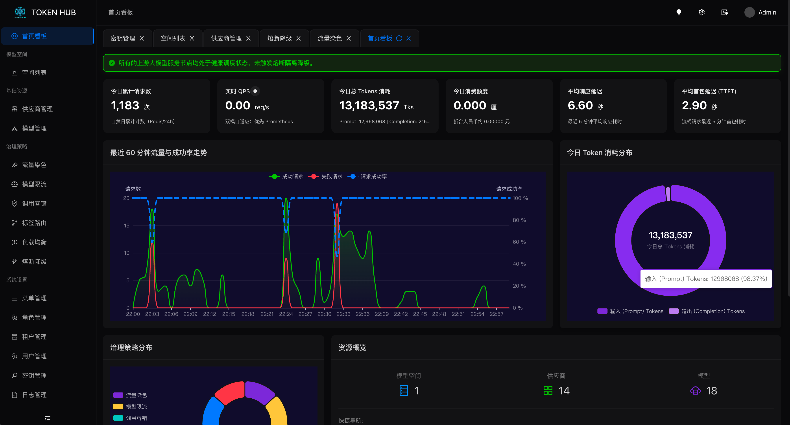
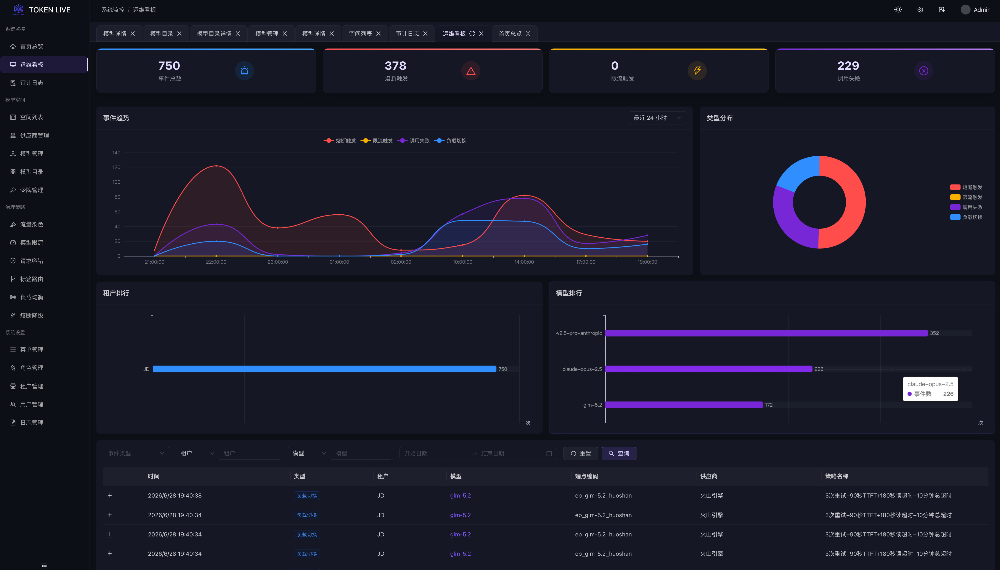

# TokenLive

[English](./README.md) | 中文版

> 基于 [joylive-agent](https://github.com/jd-opensource/joylive-agent) 架构理念的高性能 LLM API网关
>
> 📖 **“在代码的脉络里，让治理永续，让生命长青。”** — 纪念 TokenLive 的由来与精神传承，详见 [TokenLive 命名故事](./docs/origin_of_tokenlive.md)。

[](https://golang.org)
[](LICENSE)
[](https://platform.openai.com/docs/api-reference)

## 项目简介

TokenLive 是一个高性能、可扩展的LLM API网关，借鉴[joylive-agent](https://github.com/jd-opensource/joylive-agent)的Gin Shell + Engine Pipeline架构理念，使用Go实现。是一款专为大模型（LLM）算力生态打造的高性能、企业级大模型网关。网关基于成熟的微服务治理模型设计，内置丰富的智能路由与流量治理策略，天然支持海量并发流量与弹性横向扩容。通过深度优化请求链路，网关能够极大降低LLM调用失败率，为高并发、高可用的AI应用场景提供坚如磐石的稳定性保障。

### 核心能力

TokenLive 专为大模型算力生态及高并发生产环境打造，具备以下五大核心能力：

1. **多模型协议兼容与极致扩展 (Protocol Compatibility & Extensibility)**
   - **OpenAI 协议全兼容**：对外暴露完全兼容 OpenAI Chat、Embeddings、Models 的统一标准 API，降低客户端接入与迁移成本。
   - **能力导向设计 (Capability-based)**：通过 `requestTypes() []RequestType` 声明 Provider 能力（支持 chat, embedding, image 等多种接口），扩展新接口或厂商零侵入。
   - **多厂商生态集成**：原生集成 OpenAI、Anthropic 等主流 LLM 提供商，支持 Endpoint 级别的上游模型名称重写（UpstreamModel 机制）及加权路由。

2. **企业级流量治理与高可用 (Traffic Governance & High Availability)**
   - **双层熔断故障隔离**：内置 Endpoint 级（单实例）与 Provider 级（服务商模型级）双层熔断机制，使用进程本地内存维护状态，支持滑动窗口错误率及慢调用率统计。
   - **8 种高级负载均衡算法**：提供 RoundRobin、WeightedRoundRobin、Random、LeastConnections、LeastLatency、Cost、Sticky（粘性会话维持 Prompt Cache 亲和性）及 Composite 负载均衡，算法计算保持并发安全与无状态。
   - **动态路由过滤链 (RouterChain)**：每次请求尝试（Attempt）均动态跑路由链（CapabilityRouter -> TagRouter -> CircuitBreakerRouter），动态剔除异常或被熔断的节点。
   - **智能重试与退避机制**：基于 `error_rules` 识别故障类型，支持配置化的指数抖动（Exponential Jitter）退避重试，最大程度降低 LLM 偶发性调用失败率。

3. **精细化多维度策略引擎 (Dynamic Policy Engine)**
   - **机制与策略解耦**：Engine 管线（Pipeline）负责机制的声明与执行，而具体的限流、计费、熔断等治理行为由内存中的 Policy 动态控制，避免静态管线臃肿。
   - **四级优先级策略覆盖**：采用 `user+model` > `model+*` > `*+user` > `YAML/global 兜底` 的多维度策略归并匹配算法，支持字段级非零值合并。
   - **无锁热更新机制**：基于 Redis 主配置源配合定时轮询，采用 `atomic.Pointer` 整体原子替换内存中的 PolicyMatcher，实现高并发下的零停机无锁配置热重载。
   - **分层鉴权控制**：Gin 外壳中间件进行 API Key 身份验证（AuthN），Core Engine 内部 AuthFilter 根据策略评估进行模型白名单访问授权（AuthZ），默认权限关闭，保障多租户资源安全.

4. **高精度实时结算与退款 (Billing & Token Settlement)**
   - **流式响应透明拦截**：利用 `SSEInterceptWriter` 透明包装 ResponseWriter，支持流式 SSE 帧的增量解析，精准计算首字节响应延迟（TTFT）及 Prompt/Completion Token 消耗。
   - **预扣费与差额退款结算**：针对 Token 桶限流，请求开始时基于输入长度投机预扣 Token，在响应结束后读取最终成功执行的 Endpoint 和 Policy 计费单价，实行高精度差额结算与退款，完美适配模型降级与重试场景。
   - **可插拔 Token 提取器**：内置 OpenAI 与 Anthropic 格式的 TokenExtractor 扩展，满足不同协议的流式计费需求。

5. **高并发高可用系统容灾 (System Resilience & Optimization)**
   - **本地双轨二级缓存**：对 API Key 鉴权及 Policy 实行高并发本地二级缓存（30s 正向 LRU 缓存与 10s 负向缓存防穿透），极大地降低了 Redis 的查询压力。
   - **异常补偿队列 (Compensation Queue)**：基于 Redis Stream + 消费组实现，在计费结算或会话粘性记录失败时，自动入队并触发后台指数退避重试，配合 Dead Letter Queue (DLQ) 处理，确保财务与会话状态最终一致。
   - **优雅关闭与资源释放**：`Engine.Close()` 遵循严格的拓扑关系按序优雅关闭（先 cancel context 拒绝新请求 -> 刷新补偿队列 -> 停止 StateStore -> 关闭服务发现），确保平滑滚动升级。
   - **对象池化降 GC 压力**：贯穿管线的核心上下文 `GatewayContext` 采用 `sync.Pool` 进行高度池化复用，杜绝高并发下的堆内存频繁分配。

6. **灵活的多后端适配与无 Redis 性能保障 (Multi-Backend & No-Redis Mode)**
   - **完全配置解耦**：显式支持 `config_source` (local/redis/http) 与 `state_store` (memory/redis) 独立配置，摆脱对 Redis 的强依赖。
   - **细粒度 HTTP 轮询 (1:1 粒度对齐)**：在无 Redis 部署下，网关通过三个独立的细粒度 HTTP 同步通道（/config, /policies, /apikeys）与管理后台进行增量同步，大大降低带宽与解析开销。
   - **动态回源 fallback (On-Demand Fallback)**：本地内存未命中 API Key 时，网关同步向管理后台发起单条 HTTP 查询，并在内存中完成配额扣减，实现“即加即用”的高可用单机体验。

---

## 管理控制台截图





---

## 架构设计

### 1. 骨架设计：Gin Shell + Engine Pipeline

TokenLive 采用分层解耦的“外壳+内核”骨架：

- **Gin Shell (外壳)**：Gin 仅用于网关最外层，承载 CORS、Swagger 注册、用户注册登录及 API Key 身份校验 (AuthN) 中间件。
- **Engine Pipeline (内核)**：一旦进入 LLM 路由，请求会被剥离并转化为核心的 `Engine` 接管。核心管线**零 Gin 依赖**，纯基于原生 Go `net/http` 运行，极大地方便了独立测试或将其作为微服务 SDK 嵌入其他项目。

### 2. 核心流转：三层过滤与嵌套调用语义

Engine 内部通过清晰定义的三层执行语义来保障请求的高效路由和故障降级：

- **InboundFilter 链**（每请求执行1次）：AuthFilter 鉴权、RateLimitFilter 限流预扣、ValidateFilter 校验。
- **FallbackInvoker**（模型级级联降级）：支持首选模型失败后透明地按链条降级（如 gpt-4 -> gpt-3.5）。若响应已输出首字节（TTFT > 0），则禁止重试与降级，直接透传错误。
- **ClusterInvoker**（单模型路由重试）：编排 Discovery 获取端点 -> 跑 RouterChain 链式过滤节点 -> LoadBalancer 软选择端点 -> 调用 ProviderInvoker。如果失败且命中 `error_rules`，则执行 Attempt 级重试，更换端点。
- **ProviderInvoker**（叶子适配器）：封装 Provider，透明包裹 ResponseWriter 拦截流式输出。
- **OutboundFilter 链**（始终执行1次）：在 Invoke 结束后统一运行。包含 Token 差额结算、会话粘性保存、Prometheus 指标统计、Zap 审计日志记录。

```
                    ┌────────────────────────────┐
                    │  Gin Shell (外壳中间件/CORS) │
                    └─────────────┬──────────────┘
                                  │ HandleRequest(w, r)
 ┌────────────────────────────────▼────────────────────────────────┐
 │ Gateway Engine (内核管线, 零 Gin 依赖)                             │
 │                                                                 │
 │  ┌─────────────────┐                                            │
 │  │ Inbound Filters │  → AuthFilter (AuthZ 授权控制)              │
 │  │ (执行 1 次)      │  → RateLimitFilter (限流预扣 Token)         │
 │  └────────┬────────┘  → ValidateFilter (参数格式校验)            │
 │           │                                                     │
 │  ┌────────▼────────┐                                            │
 │  │ FallbackInvoker │  → gpt-4 (首选模型 ClusterInvoker)           │
 │  │ (模型级级联降级)  │  ↳ gpt-3.5 (降级模型 ClusterInvoker)         │
 │  └────────┬────────┘                                            │
 │           │                                                     │
 │  ┌────────▼────────┐                                            │
 │  │ OutboundFilters │  → TokenSettlementFilter (高精度差额扣费/退款) │
 │  │ (始终执行 1 次)  │  → StickySaveFilter (会话粘性保存)            │
 │  └─────────────────┘  → MetricsFilter & AccessLogFilter         │
 └─────────────────────────────────────────────────────────────────┘
```

### 3. 数据流与状态设计：本地无状态与外置状态层

为了适应云原生及容器化水平扩容，TokenLive 在设计上坚持本地无状态原则：

- **无状态计算**：网关本身不维护跨请求的用户状态、限流令牌或负载均衡指标，所有的状态读写均抽象为 `StateStore` 接口，支持 Memory（开发测试）和 Redis（生产）的双实现。
- **高可靠最终一致性**：核心的计费和 Sticky Session 写入等关键 Outbound 行为，一旦 StateStore 发生偶发性 Redis 写入失败，过滤器会自动将任务推入 Redis Stream 驱动的 **Compensation Queue (异常补偿队列)**，后台消费组通过指数退避机制不断重试，直至成功，防止财务“漏单”。
- **共享 Redis 客户端**：StateStore 与 Compensation Queue 在物理上共享同一套 Redis 连接池，仅通过 Key 前缀（如 `aigw:store:*` 与 `aigw:comp:*`）进行逻辑隔离，简化运维成本。

---

## 快速开始

### 前置条件

- Go 1.24+
- MySQL / PostgreSQL / SQLite（用户管理）
- Redis（可选，用于 StateStore / 补偿队列）

### 安装依赖

```bash
make init          # 安装开发工具：wire, mockgen, swag
go mod tidy
```

### 启动服务

```bash
# 使用本地配置（默认 config/local.yml）
go run ./cmd/server

# 指定配置文件
APP_CONF=config/prod.yml go run ./cmd/server

# 或构建二进制
make build
./bin/tokenlive-gateway
```

### 生产部署

对于生产环境，强烈推荐使用统一的部署项目 [tokenlive-deploy](https://github.com/tokenlive/tokenlive-deploy) 来一键部署 TokenLive 全家桶（包含 Admin 控制台、Gateway 网关、Redis、Prometheus 以及 Caddy 反向代理）。

### 调用 API

```bash
# 1. 聊天补全 (OpenAI 协议)
curl -X POST http://localhost:8000/v1/chat/completions \
  -H "Authorization: Bearer sk-your-api-key" \
  -H "Content-Type: application/json" \
  -d '{"model":"gpt-4","messages":[{"role":"user","content":"Hello!"}]}'

# 2. 流式聊天完成 (OpenAI 协议，流式返回)
curl -X POST http://localhost:8000/v1/chat/completions \
  -H "Authorization: Bearer sk-your-api-key" \
  -H "Content-Type: application/json" \
  -d '{"model":"gpt-4","stream":true,"messages":[{"role":"user","content":"Hello"}]}'

# 3. Anthropic Messages 补全 (Anthropic 协议)
curl -X POST http://localhost:8000/v1/messages \
  -H "Authorization: Bearer sk-your-api-key" \
  -H "Content-Type: application/json" \
  -d '{"model":"claude-3-5-sonnet","max_tokens":1024,"messages":[{"role":"user","content":"Hello, Claude!"}]}'

# 4. Responses 统一响应补全 (TokenLive 会根据上游能力自动降级翻译为 chat/completions)
curl -X POST http://localhost:8000/v1/responses \
  -H "Authorization: Bearer sk-your-api-key" \
  -H "Content-Type: application/json" \
  -d '{"model":"gpt-4","instructions":"You are a helpful assistant.","input":"Explain quantum computing briefly.","max_output_tokens":512}'

# 5. 嵌入向量 (OpenAI 协议)
curl -X POST http://localhost:8000/v1/embeddings \
  -H "Authorization: Bearer sk-your-api-key" \
  -H "Content-Type: application/json" \
  -d '{"model":"text-embedding-ada-002","input":"Hello world"}'

# 6. 列出当前 API Key 授权的模型（数据源：Redis SET aigw:user:{userID}:models）
curl http://localhost:8000/v1/models \
  -H "Authorization: Bearer sk-your-api-key"

# 7. 网关健康检查
curl http://localhost:8000/health

# 8. Prometheus 监控指标
curl http://localhost:8000/metrics
```

## API 端点

| 端点 | 方法 | 说明 |
|------|------|------|
| `/v1/chat/completions` | POST | 聊天补全（支持流式 SSE） |
| `/v1/messages` | POST | Anthropic Messages 聊天补全（支持流式 SSE） |
| `/v1/responses` | POST | Responses 统一响应格式（支持自动降级翻译为 chat/completions 路由） |
| `/v1/embeddings` | POST | 创建嵌入向量 |
| `/v1/models` | GET | 返回当前 API Key 授权的模型列表（OpenAI 标准格式）。数据源：Redis SET `aigw:user:{userID}:models`；未鉴权返回 401，用户未授权任何模型返回 `{object:"list", data:[]}` |
| `/health` | GET | 健康检查 |
| `/metrics` | GET | Prometheus 指标 |

## 配置

LLM 配置采用关系型三表结构（models / providers / model_providers），配置数据源分层：YAML 默认层 + Redis 覆盖层。

```yaml
# 模型定义
models:
  gpt-4:
    real_model: gpt-4
    request_type: chat_completion

# Provider 定义（上游来源）
providers:
  openai-official:
    type: openai
    api_key: ${OPENAI_API_KEY}
    timeout: 60s
    endpoints:
      - url: https://api.openai.com/v1
        weight: 1

# Model-Provider 关联（多对多）
model_providers:
  - model: gpt-4
    provider: openai-official
    priority: 1
    weight: 100

# 全局降级策略
fallbacks:
  gpt-4:
    - gpt-3.5-turbo
```

字段继承优先级：model_provider 级别 > provider 级别 > 默认值。详见 `config/llm.example.yml` 和 `docs/adr/`。

## 开发命令

```bash
make build         # 构建二进制到 ./bin/tokenlive-gateway
make test          # 运行测试（输出 coverage.html）
make mock          # 重新生成 gomock mocks
make swag          # 重新生成 Swagger 文档
make bootstrap     # 启动 docker-compose 基础设施 + 迁移 + 启动服务
```

运行单个测试：

```bash
go test ./pkg/core/... -run TestEngine -v
go test ./pkg/llm/... -run TestSSEParser -v
go test ./pkg/filters/... -run TestRateLimit -v
```

## Provider 扩展

Provider 通过 `init()` 自动注册到全局工厂：

```go
func init() {
    core.RegisterProviderFactory(core.ProviderOpenAI,
        func(name, baseURL, apiKey string, models []string) core.Provider {
            return NewOpenAIProvider(name, baseURL, apiKey, models)
        })
}
```

添加新 Provider 只需：

1. 在 `pkg/llm/providers/` 下实现 `core.Provider` 接口
2. 在 `init()` 中调用 `core.RegisterProviderFactory()`
3. 引入 `_ "tokenlive-gateway/pkg/llm/providers"` 触发注册

## 设计文档

- **[架构设计文档](docs/architecture.md)** — 完整的架构决策（187 项）、接口定义、Mermaid 图和实现路线

## Roadmap

- [x] Gin Shell + Engine Pipeline 架构
- [x] 三层 Filter 模型（Inbound → ClusterInvoker → Outbound）
- [x] Invoker 统一调用抽象（ProviderInvoker / ClusterInvoker / FallbackInvoker）
- [x] Capability-based Provider 接口
- [x] OpenAI 和 Anthropic Provider 实现
- [x] SSE 增量解析器 + 拦截 Writer（可插拔 TokenExtractor）
- [x] Router Chain（熔断、能力匹配、标签路由）
- [x] 8 种负载均衡策略
- [x] StateStore 抽象（内存 + Redis）
- [x] 双层熔断器
- [x] 补偿队列（Redis Stream）
- [x] 配置热更新（分层配置源，Redis 定时轮询与热更新）
- [x] Filter Pipeline 生产接入（8 个 Filter 全部注册到 Engine）
- [x] Engine 拆分（engine.go / engine_builder / engine_request / engine_response）
- [x] Engine.Close() 优雅关闭（cancel → compQueue → stateStore → discovery）
- [x] 补偿队列集成（CriticalOutboundFilter 失败自动入队 + Redis Stream 重试）
- [x] PolicyMatcher 热更新（atomic.Pointer 无锁读 + Redis 定时拉取）
- [x] Provider 健康检查（后台 goroutine 探活 + StaticDiscovery 状态更新）
- [x] 共享 Redis 客户端（StateStore + CompensationQueue 复用连接）
- [x] 关系型三表配置（models / providers / model_providers）
- [x] 分层配置源（YAML 默认 + Redis 覆盖 + 懒加载 + 版本轮询）
- [x] UpstreamModel 机制（Endpoint 级 model 名替换）
- [x] Web UI 管理界面
- [ ] 更多 Provider（Google Gemini、DeepSeek、Qwen）
- [ ] K8s 服务发现完整集成
- [ ] Docker / Kubernetes Helm Chart 部署

## License

Apache 2.0

## 贡献

欢迎提交 Issue 和 Pull Request！

---

**基于 joylive-agent 架构理念 | Gin Shell + Engine Pipeline | 为生产环境优化**
