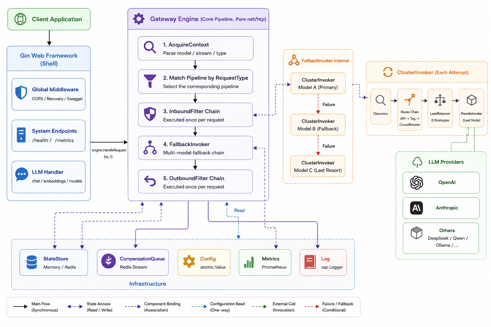

# TokenLive

English | [中文版](./README-zh.md)

> A high-performance LLM API gateway based on the architectural concepts of [joylive-agent](https://github.com/jd-opensource/joylive-agent)
>
> 📖 **"In the syntax of code, let governance endure and life remain forever green."** — Learn more about the tribute and story behind our name: [The Origin of TokenLive](./docs/origin_of_tokenlive_en.md).

[](https://golang.org)
[](LICENSE)
[](https://platform.openai.com/docs/api-reference)

## Project Introduction

TokenLive is a high-performance and extensible LLM API gateway implemented in Go, drawing inspiration from the Gin Shell + Engine Pipeline architectural concepts of [joylive-agent](https://github.com/jd-opensource/joylive-agent). Designed as an enterprise-grade gateway for large language model (LLM) computing ecosystems, it is built on a mature microservice governance model. It features a rich set of built-in intelligent routing and traffic governance policies, inherently supporting massive concurrent traffic and flexible horizontal scaling. By deeply optimizing the request pipeline, the gateway significantly reduces LLM invocation failure rates, delivering rock-solid stability for high-concurrency, high-availability AI application scenarios.

### Online Demo

- **Demo URL**: [https://tokenlive.store](https://tokenlive.store)
- **Username**: `admin`
- **Password**: `tokenlive`

### Core requestTypes

TokenLive is tailored for large-scale language model ecosystems and high-concurrency production environments, offering five core requestTypes:

1. **Multi-Model Protocol Compatibility & Extensibility**
   - **Full OpenAI Compatibility**: Exposes a unified API that is fully compatible with OpenAI standards (Chat, Embeddings, Models), significantly lowering client onboarding and migration overhead.
   - **Capability-Based Design**: Decouples provider capability registration via `requestTypes() []RequestType` (supporting chat, embedding, image, etc.), allowing seamless extension to new interfaces and custom vendors.
   - **Multi-Vendor Integration**: Built-in support for major upstream providers like OpenAI and Anthropic, featuring model name rewriting at the endpoint level (UpstreamModel mechanism) and weighted routing.

2. **Enterprise-Grade Traffic Governance & High Availability**
   - **Dual-Layer Circuit Breaker**: Endpoint-level (single instance) and Provider-level (service provider and model) circuit breakers. Maintains state in local memory using sliding windows for error rate and slow-call rate tracking.
   - **8 Advanced Load Balancing Algorithms**: Concurrency-safe, stateless strategies including RoundRobin, WeightedRoundRobin, Random, LeastConnections, LeastLatency, Cost, Sticky (for Prompt Cache affinity), and Composite routing.
   - **Dynamic Router Chain**: Executes a linear filter chain (CapabilityRouter -> TagRouter -> CircuitBreakerRouter) on every request attempt, dynamically excluding unhealthy or circuit-broken endpoints.
   - **Smart Retry & Backoff**: Evaluates network failures based on configurable `error_rules`, with Exponential Jitter backoff retries to minimize transient LLM call failures.

3. **Fine-Grained Multi-Dimensional Policy Engine**
   - **Decoupled Mechanism and Policy**: The core pipeline handles the execution flow, whereas granular rate-limiting, billing, and failover behavior are dynamically determined in-memory by matched `Policy` objects.
   - **Four-Level Policy Override**: Multi-dimensional rule matching with precedence order: `user+model` > `model+*` > `*+user` > `YAML/global fallback`, supporting field-level non-zero merges.
   - **Lock-Free Hot Reload**: Seamless config updates by polling Redis and atomically swapping the memory-cached PolicyMatcher using `atomic.Pointer`, achieving zero-downtime under high concurrency.
   - **Layered AuthN & AuthZ**: Outer Gin middlewares handle API Key verification (AuthN to identify UserID), while the Core Engine's `AuthFilter` evaluates policies to authorize specific models (AuthZ), closed-by-default for tenant-level isolation.

4. **High-Precision Billing & Refund Settlement**
   - **Transparent SSE Interception**: Leverages `SSEInterceptWriter` to wrap the standard ResponseWriter, parsing streaming events incrementally to capture TTFT (Time to First Token) and token usage.
   - **Token Estimation & Refund Settlement**: Pre-allocates token quota based on estimated prompt length at request inception, and performs differential refunds based on actual completion token counts and policy unit rates after invocation ends. Fully compatible with model fallbacks and retries.
   - **Pluggable Token Extractor**: Built-in token count extraction logic supporting OpenAI and Anthropic formats, easily extensible to other streaming structures.

5. **High-Concurrency Resilience & Optimization**
   - **Dual-Track L2 Cache**: Implements an expirable positive LRU cache (30s) and negative cache (10s) for API keys and policies, alleviating Redis read pressure under high QPS.
   - **Redis-Backed Compensation Queue**: Backed by Redis Stream and Consumer Groups. Failed critical tasks (e.g. token settlement, sticky updates) are queued for background backoff retries and DLQ routing, guaranteeing eventual consistency.
   - **Graceful Shutdown**: Core components are sequentially shut down in structural order (cancelling active contexts -> flushing compensation tasks -> closing StateStore -> unregistering Discovery) to facilitate smooth rolling deployments.
   - **GatewayContext Pooling**: Pools and recycles the core pipeline context `GatewayContext` via `sync.Pool`, eliminating frequent heap allocations and minimizing GC latency.

6. **Flexible Multi-Backend & No-Redis Performance (Multi-Backend & No-Redis Mode)**
   - **Complete Configuration Decoupling**: Explicitly supports `config_source` (local/redis/http) and `state_store` (memory/redis) independent configurations, removing the hard dependency on Redis.
   - **Granular HTTP Polling (1:1 Granularity Alignment)**: In No-Redis deployments, the gateway synchronizes incrementally with the admin console through three independent, granular HTTP channels (/config, /policies, /apikeys), drastically reducing bandwidth and parsing overhead.
   - **On-Demand Dynamic Fallback**: If an API Key is not found in the local cache, the gateway dynamically queries the admin console via a single-key HTTP request and processes quota deductions in memory, delivering an instant "add-and-use" high-availability experience.

---

## Architecture Design

### 1. Architectural Bone: Gin Shell + Engine Pipeline

TokenLive utilizes a decoupled "outer shell + inner core" architecture:

- **Gin Shell**: Handles global outer-layer tasks like CORS, Swagger registry, and API Key authentication (AuthN).
- **Engine Pipeline**: Once LLM routing takes place, the request is detached and handed over to the core `Engine`. This execution pipeline has **zero Gin dependency** and is built on standard `net/http` components, making it highly testable and embeddable as an SDK.

### 2. Request Flow: Layered Filters & Nested Invocation Semantics

The Engine governs request execution through clean, three-layered semantics:

- **Inbound Filter Chain** (executed once per request): `AuthFilter` (AuthZ model whitelist check) -> `RateLimitFilter` (token bucket pre-allocation) -> `ValidateFilter` (request structure verification).
- **FallbackInvoker** (model-level cascade degradation): Orchestrates fallbacks from primary to fallback models (e.g., gpt-4 -> gpt-3.5). Once the first streaming byte is sent to the client (TTFT > 0), fallbacks and retries are disabled to prevent malformed streaming.
- **ClusterInvoker** (single-model routing & retry): Resolves service endpoints via Discovery, applies linear Router filtering, selects an endpoint using LoadBalancer, and executes a ProviderInvoker. Performs retry attempts on subsequent nodes if errors match `error_rules`.
- **ProviderInvoker** (leaf adapter): Connects to the upstream provider (e.g., OpenAI, Anthropic) and wraps response streams.
- **Outbound Filter Chain** (always executed once): Runs after the invocation completes to process token settlement, sticky route updates, Prometheus metrics, and access auditing.



### 3. State & Storage Design: Stateless Computing & Shared Redis

To simplify container scaling, TokenLive externalizes all persistent state:

- **Stateless Computation**: The gateway instances do not hold state locally. All cross-request metadata (rate-limiting tokens, sticky tags, channel latencies) are managed via the `StateStore` interface, supporting In-Memory and Redis implementations.
- **Eventual Consistency**: Critical Outbound tasks like billing and sticky updates are guaranteed by the **Compensation Queue** (Redis Stream-backed). If the Redis cluster experiences a transient outage, failed tasks are enqueued for background exponential backoff retries.
- **Shared Connection Pool**: The StateStore and Compensation Queue share the same Redis client pool, logically separated by key prefixes (e.g., `aigw:store:*` and `aigw:comp:*`) to simplify infrastructure overhead.

---

## Quick Start

### Prerequisites

- Go 1.24+
- MySQL / PostgreSQL / SQLite (for User Management)
- Redis (optional, for StateStore / Compensation Queue)

### Install Dependencies

```bash
make init          # Install dev tools: wire, mockgen, swag
go mod tidy
```

### Start Server

```bash
# Start using local configuration (default: config/local.yml)
go run ./cmd/server

# Specify a custom config file
APP_CONF=config/prod.yml go run ./cmd/server

# Or build and run binary
make build
./bin/tokenlive-gateway
```

### Production Deployment

For production environments, we highly recommend using the unified deploy project: [tokenlive-deploy](https://github.com/tokenlive/tokenlive-deploy) to deploy the entire TokenLive stack (including Admin Console, Gateway, Redis, Prometheus, and Caddy reverse proxy) with a single command.

### Homebrew (macOS Single-Host)

For macOS single-host deployment with Gateway + Admin in one process:

```bash
brew tap tokenlive/tokenlive
brew install tokenlive
brew services start tokenlive
# http://127.0.0.1:2525  admin / admin
```

See [tokenlive-standalone](https://github.com/tokenlive/tokenlive-standalone) for details.

### Call API

```bash
# 1. Chat Completion (OpenAI standard)
curl -X POST http://localhost:8000/v1/chat/completions \
  -H "Authorization: Bearer sk-your-api-key" \
  -H "Content-Type: application/json" \
  -d '{"model":"gpt-4","messages":[{"role":"user","content":"Hello!"}]}'

# 2. Stream Chat Completion (OpenAI standard, streaming SSE)
curl -X POST http://localhost:8000/v1/chat/completions \
  -H "Authorization: Bearer sk-your-api-key" \
  -H "Content-Type: application/json" \
  -d '{"model":"gpt-4","stream":true,"messages":[{"role":"user","content":"Hello"}]}'

# 3. Anthropic Messages Completion (Anthropic standard)
curl -X POST http://localhost:8000/v1/messages \
  -H "Authorization: Bearer sk-your-api-key" \
  -H "Content-Type: application/json" \
  -d '{"model":"claude-3-5-sonnet","max_tokens":1024,"messages":[{"role":"user","content":"Hello, Claude!"}]}'

# 4. Responses Unified Request (Automatically downgraded and translated to chat/completions by TokenLive)
curl -X POST http://localhost:8000/v1/responses \
  -H "Authorization: Bearer sk-your-api-key" \
  -H "Content-Type: application/json" \
  -d '{"model":"gpt-4","instructions":"You are a helpful assistant.","input":"Explain quantum computing briefly.","max_output_tokens":512}'

# 5. Embeddings (OpenAI standard)
curl -X POST http://localhost:8000/v1/embeddings \
  -H "Authorization: Bearer sk-your-api-key" \
  -H "Content-Type: application/json" \
  -d '{"model":"text-embedding-ada-002","input":"Hello world"}'

# 6. List Authorized Models for current API Key (source: Redis SET "aigw:user:{userID}:models")
curl http://localhost:8000/v1/models \
  -H "Authorization: Bearer sk-your-api-key"

# 7. Gateway Health Check
curl http://localhost:8000/health

# 8. Prometheus Metrics
curl http://localhost:8000/metrics
```

## API Endpoints

| Endpoint | Method | Description |
|------|------|------|
| `/v1/chat/completions` | POST | Chat completion (supports streaming SSE) |
| `/v1/messages` | POST | Anthropic Messages completion (supports streaming SSE) |
| `/v1/responses` | POST | Responses unified format (supports automatic translation to chat/completions) |
| `/v1/embeddings` | POST | Create embeddings |
| `/v1/models` | GET | List authorized models for the current API Key (OpenAI standard format). Data source: Redis SET `aigw:user:{userID}:models`. Unauthenticated requests return 401. If the user has no authorized models, returns `{object:"list", data:[]}` |
| `/health` | GET | Gateway health check |
| `/metrics` | GET | Prometheus metrics |

## Agent Tool Compatibility

TokenLive's protocol translation capability enables mainstream AI agent development tools to connect to third-party LLMs through simple configuration. The gateway performs automatic cross-protocol request/response translation at the Provider adapter layer (ProviderInvoker), including real-time frame-level SSE stream translation, fully transparent to the agent tool.

**Adapted Agent Tools:**

- **Claude Code** — By exposing the Anthropic `/v1/messages` protocol endpoint, Claude Code can point its API address to TokenLive. The gateway transparently converts requests to OpenAI-compatible protocol calls against upstream third-party models. Built-in recognition and mock response handling for Claude Code connectivity probe requests.
- **Codex** — By exposing the OpenAI `/v1/responses` protocol endpoint, Codex can point its API address to TokenLive. The gateway automatically downgrades and translates to `chat/completions` calls against upstream. Built-in auto-correction logic for non-standard tools format sent by Codex.

> For protocol translation architecture details, see [ADR-0015](docs/adr/0015-protocol-translation-at-provider-invoker.md). For a scenario overview, see [Agent Tool Compatibility Guide](docs/agent-tool-compatibility.md).

## Configuration

LLM configurations use a relational three-table database structure (models / providers / model_providers). The configuration sources are hierarchical: YAML default layer + Redis override layer.

```yaml
# Model Definition
models:
  gpt-4:
    real_model: gpt-4
    request_type: chat_completion

# Provider Definition (Upstream sources)
providers:
  openai-official:
    type: openai
    api_key: ${OPENAI_API_KEY}
    timeout: 60s
    endpoints:
      - url: https://api.openai.com/v1
        weight: 1

# Model-Provider Association (Many-to-Many)
model_providers:
  - model: gpt-4
    provider: openai-official
    priority: 1
    weight: 100

# Global Fallback/Degradation Policy
fallbacks:
  gpt-4:
    - gpt-3.5-turbo
```

Field inheritance priority: model_provider level > provider level > default value. See `config/llm.example.yml` and `docs/adr/` for details.

## Development Commands

```bash
make build         # Build binary to ./bin/tokenlive-gateway
make test          # Run tests (outputs coverage.html)
make mock          # Regenerate gomock mocks
make swag          # Regenerate Swagger documentation
make bootstrap     # Start docker-compose infrastructure + migration + server
```

Run a single test:

```bash
go test ./pkg/core/... -run TestEngine -v
go test ./pkg/llm/... -run TestSSEParser -v
go test ./pkg/filters/... -run TestRateLimit -v
```

## Provider Extension

Providers are automatically registered to the global factory via `init()`:

```go
func init() {
    core.RegisterProviderFactory(core.ProviderOpenAI,
        func(name, baseURL, apiKey string, models []string) core.Provider {
            return NewOpenAIProvider(name, baseURL, apiKey, models)
        })
}
```

To add a new Provider:

1. Implement the `core.Provider` interface under `pkg/llm/providers/`
2. Call `core.RegisterProviderFactory()` in `init()`
3. Import `_ "tokenlive-gateway/pkg/llm/providers"` to trigger registration

## Design Documentation

- **[Architecture Design Document](docs/architecture.md)** — Complete architectural decisions (187 decisions), interface definitions, Mermaid diagrams, and implementation roadmap.

## Roadmap

- [x] Gin Shell + Engine Pipeline architecture
- [x] Three-layer Filter model (Inbound → ClusterInvoker → Outbound)
- [x] Invoker unified calling abstraction (ProviderInvoker / ClusterInvoker / FallbackInvoker)
- [x] Capability-based Provider interface
- [x] OpenAI and Anthropic Provider implementations
- [x] SSE incremental parser + interception Writer (pluggable TokenExtractor)
- [x] Router Chain (circuit breaker, capability matching, sticky tags routing)
- [x] 8 load balancing strategies
- [x] StateStore abstraction (in-memory + Redis)
- [x] Dual-layer circuit breaker
- [x] Compensation queue (Redis Stream)
- [x] Configuration hot-reload (layered configuration source, Redis periodic polling and hot updates)
- [x] Filter Pipeline production registration (all 8 filters registered to Engine)
- [x] Engine codebase modularization (engine.go / engine_builder / engine_request / engine_response)
- [x] Graceful shutdown for Engine (cancel context → compQueue → stateStore → discovery)
- [x] Compensation queue integration (CriticalOutboundFilter failure auto-enqueuing + Redis Stream retry)
- [x] PolicyMatcher hot reload (lock-free reads via atomic.Pointer + Redis periodic pull)
- [x] Provider health check (background active probe goroutine + StaticDiscovery status update)
- [x] Shared Redis client (StateStore + CompensationQueue reusing the same connection)
- [x] Relational three-table configuration models (models / providers / model_providers)
- [x] Layered configuration sources (YAML default + Redis override + lazy loading + version polling)
- [x] UpstreamModel mechanism (Endpoint-level model name rewrite)
- [x] Web UI management console
- [ ] More Providers (Google Gemini, DeepSeek, Qwen)
- [ ] Complete Kubernetes Service Discovery integration
- [ ] Docker / Kubernetes Helm Chart deployment

## License

Apache 2.0

## Contribution

Issues and Pull Requests are welcome!

---

**Based on joylive-agent architectural concepts | Gin Shell + Engine Pipeline | Optimized for Production**
