# tokenlive-gateway 架构设计文档

> 版本: v2.6
> 日期: 2026-06-05
> 状态: Draft（§1-§12 已对齐实际代码结构，A.27 新增 14 项 Pipeline 重构，A.28 新增 4 项重试对齐决策）

---

## 目录

- [1. 概述](#1-概述)
- [2. 设计目标与原则](#2-设计目标与原则)
- [3. 整体架构](#3-整体架构)
- [4. 核心概念](#4-核心概念)
- [5. 请求处理流程](#5-请求处理流程)
- [6. 核心组件设计](#6-核心组件设计)
- [7. 策略与配置模型](#7-策略与配置模型)
- [8. 关键运行机制](#8-关键运行机制)
- [9. 可观测性](#9-可观测性)
- [10. 生命周期与配置热加载](#10-生命周期与配置热加载)
- [11. 代码组织与映射](#11-代码组织与映射)
- [12. 扩展点](#12-扩展点)
- [13. 测试策略](#13-测试策略)
- [附录 A：架构决策汇总（191 条）](#附录-a架构决策汇总191-条)

---

## 1. 概述

**tokenlive-gateway** 是一个 Go 语言实现的高性能 LLM API 网关，对外提供 OpenAI 兼容的统一接口，对内路由到多个 LLM 提供商（OpenAI、Anthropic、Google、DeepSeek、Qwen、Ollama 等）。

本文档定义 tokenlive-gateway 的目标架构。架构以 **Gin Shell + Engine Pipeline** 为骨架，借鉴微服务治理中间件的设计经验（Dubbo / Sentinel 等），通过 **三层 Filter 模型 + Invoker 抽象 + Router 链表过滤 + 嵌套 FallbackInvoker** 实现职责清晰、易扩展、易测试的请求处理管线。

核心特性：

- **统一的 Invoker 抽象**：ProviderInvoker / ClusterInvoker / FallbackInvoker 三层嵌套，模型降级、负载均衡、重试 failover 各司其职
- **API-based Provider**：通过 `requestTypes() []RequestType` 声明能力，支持 chat / embedding / image / responses 等多种接口类型，扩展新接口零侵入
- **双层熔断**：service-level（整 provider+model）+ instance-level（单 endpoint），独立配置 error_rules（采用网关进程本地内存维护状态）
- **Redis 化状态层**：StateStore（限流/sticky）+ 补偿队列（Redis Stream + Consumer Group），容器化部署友好
- **PolicyMatcher 维度优先级**：user+model > model+"*" > "*"+user > YAML 兜底，字段级合并，Redis 主数据源 + YAML 兜底
- **8 种 LoadBalancer 策略**：含 Sticky / Cost / Latency / Composite，全部以软选择形式存在
- **流式响应 SSE 拦截**：透明包装 ResponseWriter，第一字节前可 failover，发出后透传

---

## 2. 设计目标与原则

### 2.1 目标

| 目标 | 说明 |
|------|------|
| **统一接入** | 对外暴露 OpenAI 兼容 API，对内屏蔽多家 LLM 协议差异 |
| **高可用** | 失败自动 failover、双层熔断隔离故障、模型 fallback 降级、Sticky Session 维持 Prompt Cache 亲和 |
| **可治理** | 限流、计费、可观测性，按维度（user / model / apikey 组合）策略下发 |
| **可扩展** | Provider / Filter / Router / LoadBalancer / Discovery / StateStore 均为注册式扩展点 |
| **低延迟** | 流式优先、配置无锁热加载、连接复用、GatewayContext 池化 |
| **容器化友好** | 无本地状态依赖，所有跨请求状态外置到 Redis；优雅关闭支持滚动升级 |

### 2.2 设计原则

1. **职责单一**：每个 Filter / Router / Invoker 只做一件事，组合而非继承。
2. **正交分层**：路由（Routing）、负载均衡（LB）、调用（Invoke）、重试（Retry）、模型降级（Fallback）、限流（RateLimit）、熔断（CircuitBreak）相互独立，可单独替换。
3. **执行语义清晰**：Inbound / Outbound 每请求执行一次；ClusterInvoker 内部允许重试；FallbackInvoker 允许换 ClusterInvoker。
4. **错误识别由策略自治**：retry / circuit_breaker / fallback 各自配置 `error_rules`，共享 `ErrorMatcher` 原语，互不耦合。
5. **声明式 + 策略化**：管线结构由配置文件声明（静态），策略行为按维度运行时匹配（动态）。
6. **零 Gin 依赖核心**：Engine 接口只依赖 `http.ResponseWriter` + `*http.Request`，便于替换 Web 框架或独立测试。
7. **共享 Redis 集群**：StateStore 与补偿队列共用一套 Redis（key prefix 隔离），简化部署。

---

## 3. 整体架构

### 3.1 系统视图

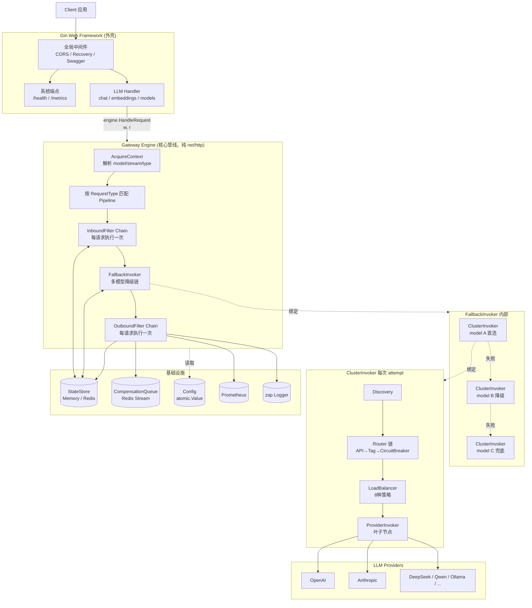

### 3.2 关键架构决策

| 决策 | 选择 |
|------|------|
| Web 框架 | Gin 作为外壳保留，Engine 在 Gin Handler 内部运行（决策 1） |
| Filter 模型 | 三层：Inbound（1x）→ FallbackInvoker → Outbound（1x）（决策 2） |
| 调用抽象 | 三种 Invoker：ProviderInvoker / ClusterInvoker / FallbackInvoker（决策 3、22、143-146） |
| Provider 接口 | API-based：`requestTypes() []RequestType` + `Invoke(ctx)`（决策 22） |
| 服务发现 | 按 model 过滤，对齐 `pkg/discovery/`（决策 16） |
| 模型降级 | 嵌套 Invoker：FallbackInvoker(ClusterInvoker(...))（决策 17、143） |
| Router 模型 | 线性 list filter，每次 attempt 重跑（决策 139'-140'、160-164） |
| Router chain | API → Tag → CircuitBreaker（决策 160-164） |
| LoadBalancer | 8 种策略，全部软选择，Sticky/Cost/Latency 也是 LB（决策 165-170） |
| 熔断器 | 双层：service-level + instance-level，独立配置（决策 32-34） |
| 错误识别 | 嵌入各策略，共享 ErrorMatcher 原语（决策 26-29） |
| 限流 | 投机预扣 + 精确结算，PolicyMatcher 维度匹配（决策 30-31） |
| StateStore | 按功能域拆方法，Memory / Redis 双实现（决策 152-156） |
| 补偿队列 | Redis Stream + Consumer Group + 延迟 ZSet（决策 109'-115） |
| 流式响应 | SSEInterceptWriter 包装，第一字节后不 retry/fallback（决策 117-118） |
| Pipeline 匹配 | 按 RequestType（chat / embedding / image / responses 等）（决策 135'） |
| LLM 配置 | Model-centric 两层结构（models 含 endpoints / providers），endpoint 为路由最小单元（ADR-0008） |
| 配置热加载 | YAML 基线 + Redis 懒加载 + 版本轮询，整体原子替换（决策 123-126、159，ADR-0004/0005） |
| GatewayContext | 强类型 struct，不实现 context.Context，sync.Pool 池化（决策 130-131） |

---

## 4. 核心概念

### 4.1 概念关系图

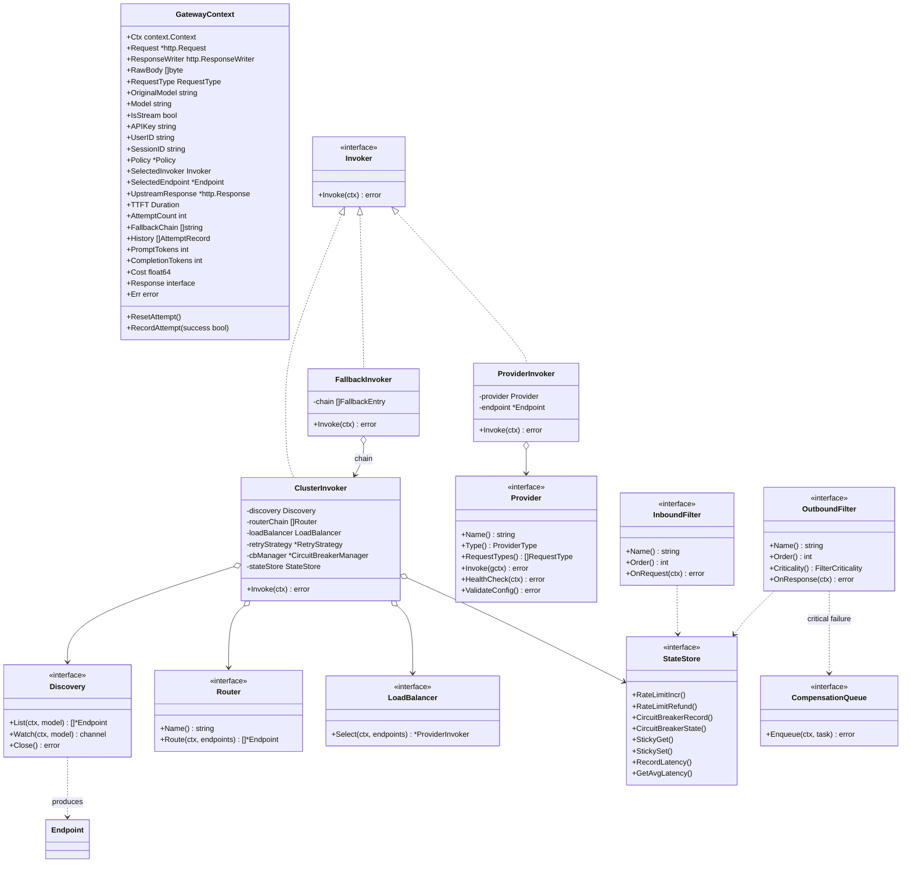

### 4.2 概念释义

| 概念 | 释义 |
|------|------|
| **GatewayContext** | 贯穿整个管线的请求上下文，强类型 struct（不实现 `context.Context`），承载请求/响应对象、元数据、路由结果、attempt 历史、最终指标。生命周期由 `sync.Pool` 管理。 |
| **Invoker** | 统一的"可被调用"抽象。`Invoke(gctx) error` 是唯一入口。 |
| **ProviderInvoker** | 叶子 Invoker。封装一个 Provider + Endpoint，发起真实的上游调用。 |
| **ClusterInvoker** | 编排型 Invoker。串联 Discovery → RouterChain → LoadBalancer → ProviderInvoker，负责单模型内的重试 / failover。每次 attempt 重跑 Router chain。 |
| **FallbackInvoker** | 模型降级编排器。持有一组 ClusterInvoker（每个绑定一个 model），按链顺序尝试。整个 ClusterInvoker 失败后切下一个 model。 |
| **Provider** | 协议适配层。声明 `RequestTypes()` 表明支持哪些 RequestType，充当连接与凭证管理器，`Invoke()` 内部委托给按 RequestType 细粒度拆分的 `RequestInvoker` 运行具体的业务接口调用逻辑。 |
| **Endpoint** | Gateway 层的"端点"概念，从 `ServiceInstance` 映射而来，包含 URL / Provider / Model / Metadata / Weight / RequestTypes。 |
| **Discovery** | 按 model 提供可用 Endpoint 列表的来源。可静态配置、可对接 K8s / Consul / Nacos。 |
| **Router** | Endpoint 列表的硬约束过滤器。list-in，list-out。三种：APIRouter / TagRouter / CircuitBreakerRouter。 |
| **LoadBalancer** | 从过滤后的候选列表中选一个，软选择。八种策略：RoundRobin / WeightedRoundRobin / Random / LeastConnections / LeastLatency / Cost / Sticky / Composite。 |
| **InboundFilter** | 请求进入 ClusterInvoker 前执行，每请求一次。Auth / RateLimit / Validate。 |
| **OutboundFilter** | 响应离开后执行，每请求一次。TokenSettlement / Sticky / Metrics / AccessLog。带 Criticality 标记（BestEffort / Critical）。 |
| **Pipeline** | 一组 InboundFilter / OutboundFilter + Invoker 配置的有序组合，按 RequestType（能力）构建。启动时从 YAML eager 构造（2-3 个），支持 `extends` 浅合并。模型级策略差异由 PolicyMatcher 运行时注入，不 bake 进 Pipeline。 |
| **PolicyMatcher** | 运行时策略匹配器。按 model+user 维度从 Redis（主数据源，四级优先）查找并字段级合并策略，写入 `gctx.Policy`。Filter 和 Invoker 从 gctx 读取策略参数。 |
| **Policy** | 单次请求的已解析策略对象，挂在 `GatewayContext` 上。Invoker 级参数（max_retries、lb_strategy）和 Filter 级参数（rate_limit、permissions）统一由 PolicyMatcher 出品。 |
| **ErrorMatcher** | 错误识别原语（status_codes / error_codes / message_patterns）。被 retry / circuit_breaker / fallback 各自的 error_rules 嵌入使用。 |
| **StateStore** | 跨请求状态抽象。按功能域提供方法：限流、Sticky Session、延迟统计。Memory / Redis 双实现。熔断由进程内本地内存中 `cbManager` 处理，不经过 StateStore。 |
| **CompensationQueue** | Critical OutboundFilter 失败后的补偿队列。Redis Stream + Consumer Group + 延迟 ZSet 实现，支持崩溃恢复（XAUTOCLAIM）。 |

### 4.3 三层执行语义

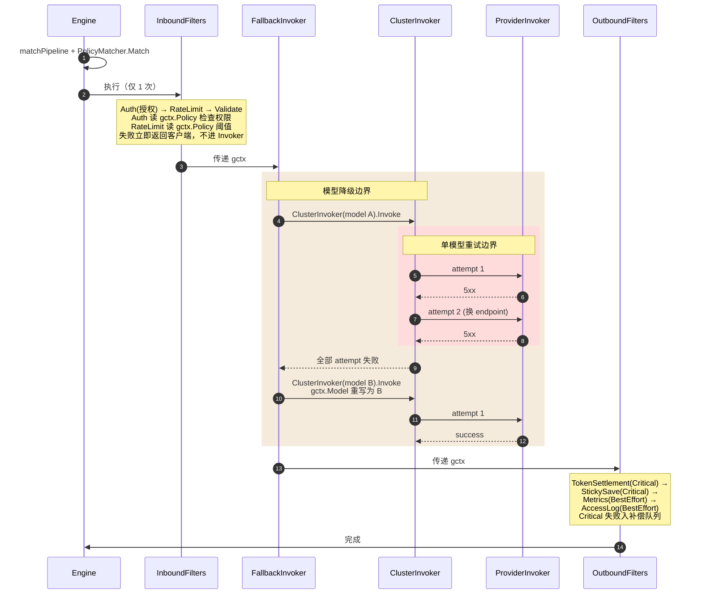

**关键不变量**：

- Inbound 失败 → 直接返回客户端，不进入 Invoker，不执行 Outbound。
- 重试仅在 ClusterInvoker 内部发生，更换 endpoint，模型不变。
- 模型降级在 FallbackInvoker 中发生，整个 ClusterInvoker 失败后切下一个 model。
- 流式响应一旦发出第一字节（`gctx.TTFT > 0`），既不能 retry 也不能 fallback，错误流透传。
- Outbound 始终执行（即使 Invoke 失败），用于结算预扣 token、记日志。
- Critical OutboundFilter 失败入补偿队列，BestEffort 失败仅记错误日志。

---

## 5. 请求处理流程

### 5.1 顶层流程

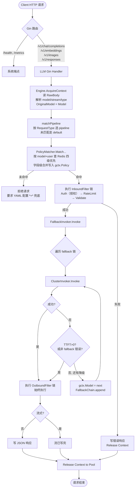

### 5.2 ClusterInvoker 内部流程

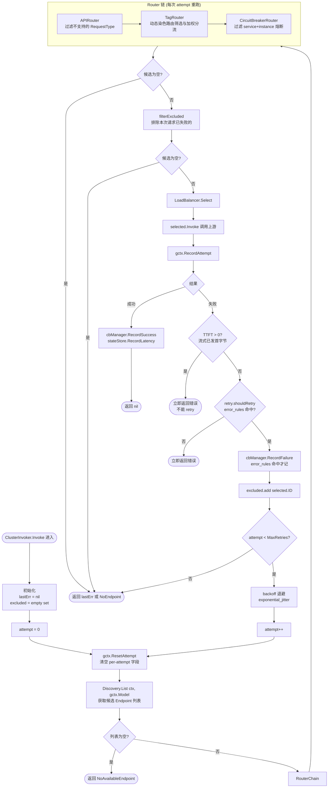

### 5.3 流式请求时序

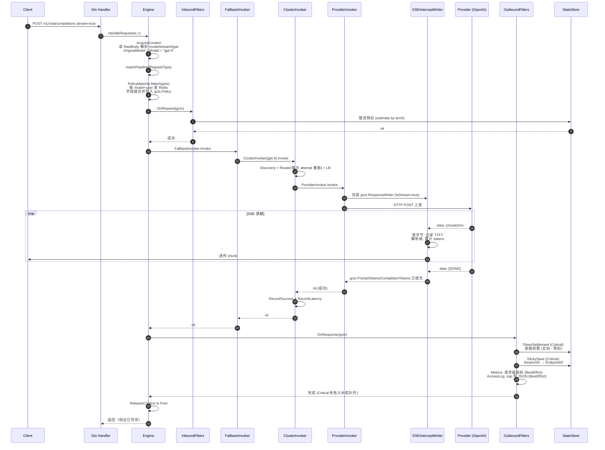

**要点**：

- `SSEInterceptWriter` 是对 `http.ResponseWriter` 的透明包装，Provider 无需感知。
- `TTFT > 0` 之后不能 retry / fallback，错误流透传给客户端。
- Outbound 在流结束后才执行，此时 token 数已准确填充。
- Critical OutboundFilter（TokenSettlement / Sticky）失败 → 任务入 Redis 补偿队列。

---

## 6. 核心组件设计

### 6.1 GatewayContext

```go
package core

type RequestType string

const (
    RequestTypeChatCompletion  RequestType = "chat_completion"
    RequestTypeEmbedding       RequestType = "embedding"
    RequestTypeImageGeneration RequestType = "image_generation"
    RequestTypeResponses       RequestType = "responses"   // 新接口示例
    RequestTypeModelList       RequestType = "model_list"
)

// GatewayContext 不实现 context.Context 接口（强类型字段优先）
type GatewayContext struct {
    // ===== 请求常量（不可变） =====
    Ctx            context.Context        // 来自 r.Context()，携带 deadline/cancel
    Request        *http.Request
    ResponseWriter http.ResponseWriter
    RawBody        []byte                 // 原始 body，[]byte 保持，各组件按需解析
    RequestType    RequestType            // 解析自 URL.Path
    OriginalModel  string                 // 用户请求的原始 model，不可变
    IsStream       bool

    // InboundFilter 填充
    APIKey    string
    UserID    string
    SessionID string

    // ===== 决策结果（Fallback 可重写 Model） =====
    Model  string  // 当前生效 model，初始 = OriginalModel，FallbackInvoker 可重写
    Policy *Policy

    // ===== Per-attempt（ResetAttempt 清空） =====
    SelectedInvoker  *ProviderInvoker
    SelectedEndpoint *Endpoint
    UpstreamConnect  time.Time
    UpstreamResponse *http.Response
    UpstreamBody     []byte
    UpstreamError    error
    TTFT             time.Duration       // 首字节时间，>0 表示流式已发出

    // ===== 累积字段 =====
    AttemptCount   int
    FallbackChain  []string              // 经过的 model 链：["gpt-4", "gpt-3.5"]
    History        []AttemptRecord
    StartTime      time.Time
    TotalLatency   time.Duration

    // ===== 最终结果 =====
    PromptTokens     int
    CompletionTokens int
    Cost             float64
    Response         interface{}          // 非流式响应体
    Err              error
}

type AttemptRecord struct {
    Model      string
    EndpointID string
    Provider   string
    Latency    time.Duration
    StatusCode int
    Error      string
    Timestamp  time.Time
}

// ResetAttempt 清空 per-attempt 字段（用于 ClusterInvoker retry）
func (c *GatewayContext) ResetAttempt() {
    c.SelectedInvoker = nil
    c.SelectedEndpoint = nil
    c.UpstreamResponse = nil
    c.UpstreamBody = nil
    c.UpstreamError = nil
    // TTFT 不重置 —— 一旦置位表示已发首字节，影响后续 retry 判断
}

// RecordAttempt 推一条 attempt 记录
func (c *GatewayContext) RecordAttempt(success bool) {
    c.History = append(c.History, AttemptRecord{
        Model:      c.Model,
        EndpointID: c.SelectedEndpoint.ID,
        Provider:   c.SelectedEndpoint.Provider,
        Latency:    time.Since(c.UpstreamConnect),
        // ...
    })
    c.AttemptCount++
}

// ===== 池化 =====
var ctxPool = sync.Pool{
    New: func() any { return &GatewayContext{} },
}

func AcquireContext(w http.ResponseWriter, r *http.Request) *GatewayContext {
    gctx := ctxPool.Get().(*GatewayContext)
    gctx.RawBody, _ = io.ReadAll(r.Body)
    r.Body.Close()

    gctx.Ctx = r.Context()
    gctx.Request = r
    gctx.ResponseWriter = w
    gctx.RequestType = resolveRequestType(r.URL.Path)
    gctx.Model = extractModel(gctx.RawBody)        // 用 gjson 快速提取，不全量反序列化
    gctx.OriginalModel = gctx.Model
    gctx.IsStream = extractStream(gctx.RawBody)
    gctx.StartTime = time.Now()
    return gctx
}

func ReleaseContext(gctx *GatewayContext) {
    *gctx = GatewayContext{}  // 清空所有字段，防止内存泄漏
    ctxPool.Put(gctx)
}
```

### 6.2 Invoker

```go
type Invoker interface {
    Invoke(gctx *GatewayContext) error
}

// ProviderInvoker 叶子节点：封装一个 Provider + Endpoint
type ProviderInvoker struct {
    provider Provider
    endpoint *Endpoint
}

func (pi *ProviderInvoker) Invoke(gctx *GatewayContext) error {
    gctx.SelectedInvoker = pi
    gctx.SelectedEndpoint = pi.endpoint

    var w http.ResponseWriter = gctx.ResponseWriter
    if gctx.IsStream {
        w = NewSSEInterceptWriter(gctx)
    }

    err := pi.provider.Invoke(gctx)
    gctx.UpstreamError = err
    return err
}

// ClusterInvoker 编排器：Discovery + Router + LB + retry
type ClusterInvoker struct {
    discovery     Discovery
    routerChain   []Router
    loadBalancer  LoadBalancer
    retryStrategy *RetryStrategy
    cbManager     *CircuitBreakerManager
    stateStore    StateStore
    logger        *zap.Logger
}

// FallbackInvoker 模型降级编排器
type FallbackInvoker struct {
    chain         []FallbackEntry
    errorRules    []ErrorRule  // 决定何时降级
}

type FallbackEntry struct {
    Model          string
    ClusterInvoker *ClusterInvoker
}

func (fi *FallbackInvoker) Invoke(gctx *GatewayContext) error {
    for i, entry := range fi.chain {
        if i > 0 {
            // 降级：重写 Model（OriginalModel 保留不变）
            gctx.Model = entry.Model
            gctx.FallbackChain = append(gctx.FallbackChain, entry.Model)
        }

        err := entry.ClusterInvoker.Invoke(gctx)
        if err == nil {
            return nil
        }
        if gctx.TTFT > 0 {
            return err  // 流式已发首字节，不能降级
        }
        if !fi.shouldFallback(err) {
            return err
        }
    }
    return ErrAllFallbackExhausted
}

// 配置中无 fallback 链时退化为透传
func BuildInvoker(cfg *PipelineConfig, deps Deps) Invoker {
    if len(cfg.Fallbacks) <= 1 {
        return buildClusterInvoker(cfg.Fallbacks[0].Model, deps)
    }
    entries := make([]FallbackEntry, len(cfg.Fallbacks))
    for i, fb := range cfg.Fallbacks {
        entries[i] = FallbackEntry{
            Model:          fb.Model,
            ClusterInvoker: buildClusterInvoker(fb.Model, deps),
        }
    }
    return &FallbackInvoker{chain: entries, errorRules: cfg.FallbackRules}
}
```

### 6.3 Provider 与 Endpoint

```go
type ProviderType string

const (
    ProviderOpenAI    ProviderType = "openai"
    ProviderAnthropic ProviderType = "anthropic"
    // ...
)

// Provider 接口 —— API-based
type Provider interface {
    Name() string
    Type() ProviderType
    RequestTypes() []RequestType         // 声明支持的接口类型
    Invoke(gctx *GatewayContext) error    // 委托给具体的 RequestInvoker 执行
    HealthCheck(ctx context.Context) error
    ValidateConfig() error
}

// RequestInvoker 接口 —— 按 RequestType 细粒度拆分调用逻辑
type RequestInvoker interface {
    Invoke(gctx *GatewayContext, p Provider) error
}
// 各厂商具体的 Invoke 逻辑并非以大块 switch-case 形式放置在 Provider 内，而是由具体的 RequestInvoker 负责


// Endpoint：Gateway 层的端点视图（统一命名）
type Endpoint struct {
    ID           string
    URL          string
    Provider     string
    Model        string
    Metadata     map[string]string  // zone, region, version, cost_per_token, ...
    Weight       int
    RequestTypes []RequestType
}

func (ep *Endpoint) SupportsRequestType(rt RequestType) bool {
    for _, c := range ep.RequestTypes {
        if c == rt { return true }
    }
    return false
}

func (ep *Endpoint) CostPerToken() float64 {
    if v, ok := ep.Metadata["cost_per_token"]; ok {
        f, _ := strconv.ParseFloat(v, 64)
        return f
    }
    return 0
}

// ServiceInstance → Endpoint 转换
func ServiceInstanceToEndpoint(si *discovery.ServiceInstance, providerName, model string, caps []RequestType) *Endpoint {
    return &Endpoint{
        ID:           si.ID,
        URL:          si.GetURL(),
        Provider:     providerName,
        Model:        model,
        Metadata:     si.Metadata,
        Weight:       si.Weight,
        RequestTypes: caps,
    }
}
```

### 6.4 Discovery

```go
type Discovery interface {
    List(ctx context.Context, model string) ([]*Endpoint, error)
    Watch(ctx context.Context, model string) (<-chan []*Endpoint, error)
    Close() error
}
```

按 model 过滤（微服务"服务名"语义）。底层适配现有 `pkg/discovery/`：

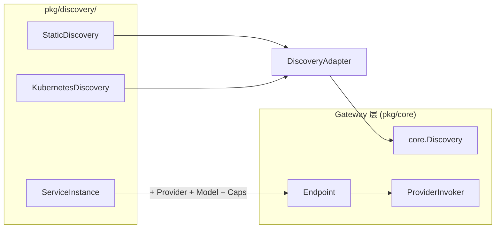

### 6.5 Router 链

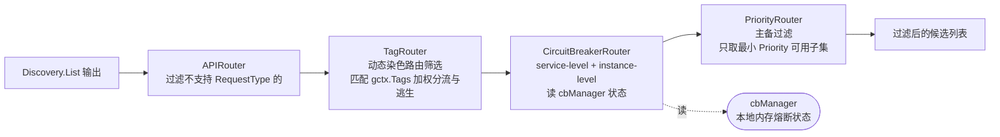

| Router | 输入 | 输出 | 行为 |
|--------|------|------|------|
| `APIRouter` | N 个 | 支持 RequestType 的子集 | 硬约束过滤 |
| `TagRouter` | N 个 | 匹配 RoutePolicy 染色标签的分流子集 | 动态路由过滤。匹配 `gctx.Tags`（由 `TaggingFilter` 染色注入），根据 `RoutePolicies` 分配的权重 and 条件选择 `Destination`，当所选通道全部被熔断或宕机时自动触发降级逃生。 |
| `CircuitBreakerRouter` | N 个 | 排除已熔断的 endpoint | 读取 cbManager 状态，不修改状态 |
| `PriorityRouter` | N 个 | 最小 Priority 可用子集 | 优先级硬过滤。在未熔断的可用端点中，提取 `Priority` 值最小（越小越优先）的端点子集，如果存在多个相同最小值的实例，则共同作为候选交给负载均衡器，用于实现 Active-Standby 温备。 |

每次 ClusterInvoker attempt 时**重跑 Router chain**，保证拿到最新熔断状态。

### 6.6 LoadBalancer

```go
type LoadBalancer interface {
    Select(gctx *GatewayContext, endpoints []*Endpoint) *ProviderInvoker
}
```

**八种策略：**

| 策略 | 配置名 | 说明 |
|------|--------|------|
| RoundRobin | `round_robin` | 轮询 |
| WeightedRoundRobin | `weighted_round_robin` | 加权轮询（Endpoint.Weight） |
| Random | `random` | 随机 |
| LeastConnections | `least_connections` | 最少活跃连接 |
| LeastLatency | `least_latency` | 最低平均延迟（StateStore） |
| Cost | `cost` | 最低单价（Endpoint.Metadata.cost_per_token） |
| Sticky | `sticky` | Session 粘性，内部包装 fallback LB |
| Composite | `composite` | 多维归一化加权（如 cost 0.7 + latency 0.3） |

```go
// Sticky 包装 fallback：miss 时落到 fallback LB
type StickyLoadBalancer struct {
    stateStore StateStore
    fallback   LoadBalancer
    keyFunc    func(gctx *GatewayContext) string
    ttl        time.Duration
}

func (s *StickyLoadBalancer) Select(gctx *GatewayContext, endpoints []*Endpoint) *ProviderInvoker {
    key := s.keyFunc(gctx)
    if key != "" {
        if epID, _ := s.stateStore.StickyGet(gctx.Ctx, key); epID != "" {
            for _, ep := range endpoints {
                if ep.ID == epID {
                    return ep.Invoker
                }
            }
        }
    }
    return s.fallback.Select(gctx, endpoints)  // 写入由 StickySessionFilter 在 Outbound 完成
}
```

### 6.7 InboundFilter / OutboundFilter

```go
type InboundFilter interface {
    Name() string
    Order() int
    OnRequest(gctx *GatewayContext) error
}

type FilterCriticality int

const (
    BestEffort FilterCriticality = iota
    Critical
)

type OutboundFilter interface {
    Name() string
    Order() int
    Criticality() FilterCriticality
    OnResponse(gctx *GatewayContext) error
}
```

**内置 InboundFilter（执行顺序）：**

| Order | Name | 职责 | 失败行为 |
|-------|------|------|---------|
| 10 | AuthFilter | 模型授权校验，检查 UserID 是否拥有当前请求模型的访问权限 | 403 |
| 15 | SessionReaderFilter | 从请求头读取 SessionID，填充 gctx.SessionID | 透传（不阻断） |
| 20 | RateLimitFilter | PolicyMatcher 维度匹配 + 投机预扣 | 429 |
| 30 | ValidateFilter | 校验请求体、model 存在性、RequestType 支持 | 400 |

**内置 OutboundFilter（执行顺序）：**

| Order | Name | Criticality | 职责 |
|-------|------|-------------|------|
| 10 | TokenSettlementFilter | Critical | 实际 token 与预扣差额结算 |
| 20 | StickySessionFilter | Critical | 保存 SessionID → EndpointID |
| 30 | MetricsFilter | BestEffort | Prometheus 请求级指标 |
| 40 | AccessLogFilter | BestEffort | zap 结构化日志输出 |

**Critical 失败行为：**

```go
for _, f := range pipeline.OutboundFilters {
    if err := f.OnResponse(gctx); err != nil {
        if f.Criticality() == Critical {
            task := buildCompTask(f, gctx)  // dedup_key = UUID
            _ = e.compQueue.Enqueue(gctx.Ctx, task)
        }
        e.logger.Error("outbound filter failed", zap.String("filter", f.Name()), zap.Error(err))
    }
}
```

熔断更新**不在 OutboundFilter**，由 ClusterInvoker 在每次 attempt 结束时直接 `RecordFailure` / `RecordSuccess`（per-attempt 精度高于 per-request）。

### 6.8 StateStore

```go
type StateStore interface {
    // 限流：投机预扣 + 精确结算
    RateLimitIncr(ctx context.Context, key string, tokens int64, window time.Duration) (remaining int64, err error)
    RateLimitRefund(ctx context.Context, key string, tokens int64) error

    // Sticky Session
    StickyGet(ctx context.Context, sessionKey string) (endpointID string, err error)
    StickySet(ctx context.Context, sessionKey string, endpointID string, ttl time.Duration) error

    // 延迟统计（LeastLatency LB）
    RecordLatency(ctx context.Context, endpointID string, latency time.Duration) error
    GetAvgLatency(ctx context.Context, endpointID string, window time.Duration) (time.Duration, error)

    Close() error
}
```

**实现：**

- `MemoryStateStore` —— 单机开发/测试，`sync.Map`
- `RedisStateStore` —— 生产部署，Lua 脚本保证限流和补偿原子性（启动时 SCRIPT LOAD 预加载）

### 6.9 CompensationQueue（Redis Stream）

#### 6.9.1 它解决什么问题

OutboundFilter 在响应离开后执行，Filter 按 `Criticality` 分两类：

- **BestEffort**（Metrics、AccessLog）：失败仅记错误日志，丢了无所谓。
- **Critical**（TokenSettlement、StickySession、限额回滚）：失败会让系统状态错乱，**不能丢，但也不能阻塞用户响应**——响应字节此时已经写回客户端。

Critical Filter 的写入对象是 Redis（StateStore），失败的典型成因是 **Redis 抖动 / 网络瞬断 / 节点切主**——属于瞬态故障，重试就能成功。直接同步重试会把 Outbound 阶段拖长甚至阻断后续请求；直接放弃则三类关键状态会持续漂移：

| Critical Filter | 直接丢弃的后果 |
|---|---|
| **TokenSettlement**（实际 token 与预扣差额结算） | 用户超额未扣 / 配额漂移，财务对不上账 |
| **StickySession**（SessionID → EndpointID 保存） | 多轮对话下次路由到别的 Provider，上下文断裂 |
| **限额回滚**（Pre-alloc 预扣 token 释放） | 预扣额度永远释放不了，限额随使用单调下降 |

补偿队列把"Critical 写失败"这一类问题从**主路径强一致**降级为**异步最终一致**：

```
主路径 Critical 写 Redis 失败
   └─> Enqueue(CompensationTask{filter, payload, attempt=0})  ── 主路径就此结束，用户响应不受影响
            │
            ▼
   后台 Worker 从 Stream 拉取 → filter.Compensate(payload) 重放
            ├─ 成功 → XACK（关键状态最终一致）
            ├─ 失败且 attempt < max → ZADD delayed（指数退避后重试）
            └─ 失败且 attempt ≥ max → XADD dlq（人工介入）
```

收益归纳为三点：

1. **主路径不被 Redis 故障拖垮**：Critical Filter 失败只产生一次 Enqueue 调用，Outbound 链不抛错给上游，用户响应延迟稳定。
2. **关键状态最终不丢**：Token 结算、Sticky 路由、限额回滚都会被异步重放至成功，财务/路由/限额三条数据线最终一致。
3. **Redis 健康度可观测**：补偿队列堆积长度、DLQ 增长速率本身就是告警信号——队列积压意味着 Redis 正在异常。

> **为什么不本地内存退化兜底？**
> Critical 状态必须在所有网关实例间共享（Sticky 跨实例、配额全局收敛）。本地队列+ Redis 队列会让同一份状态出现两套真相源，恢复时无法合并。因此 Redis 不可用时**直接丢弃 + 告警**（决策 113），不引入本地降级。

#### 6.9.2 接口与数据结构

```go
type CompensationQueue interface {
    Enqueue(ctx context.Context, task *CompensationTask) error
    // 消费由内部 worker 驱动，不暴露 Dequeue
}

type CompensationTask struct {
    ID           string             // UUID，用作 dedup_key
    FilterName   string
    Payload      map[string]any     // 重放所需最小上下文
    EnqueueAt    time.Time
    NextRetryAt  time.Time
    AttemptCount int
    LastError    string
}
```

#### 6.9.3 Redis Key 布局

| Key | 数据结构 | 用途 |
|-----|---------|------|
| `gateway:compensation:stream` | Redis Stream + Consumer Group | 主队列 |
| `gateway:compensation:delayed` | Sorted Set (score=NextRetryAt) | 延迟重试调度 |
| `gateway:compensation:dlq` | Redis Stream | 死信队列 |

#### 6.9.4 三个内部角色

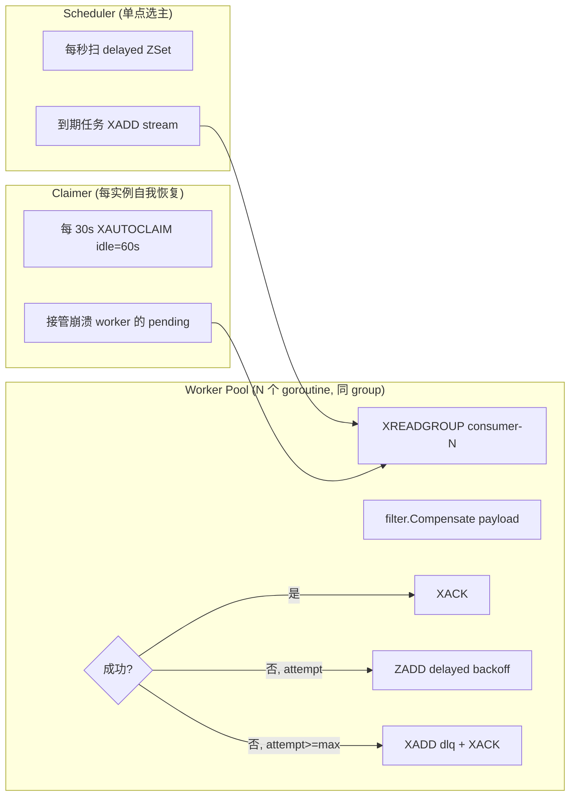

#### 6.9.5 关键约束

- 共享 StateStore 的 Redis 集群，key prefix 隔离
- 消费幂等：filter.Compensate 用 `task.ID` 作为 dedup_key 写 StateStore（Redis Lua: SET NX + INCR）
- 重启恢复自动完成：Worker XREADGROUP 拉 pending，Scheduler 扫 delayed
- Redis 不可用：直接丢弃 + 告警，不退化到本地内存（避免双队列状态不一致）

---

## 7. 策略与配置模型

### 7.1 配置整体结构

LLM 配置采用 **Model-centric 两层结构**（models / providers），endpoint 为路由最小单元，挂在 model 下。配置数据源分层：YAML 默认层 + Redis 覆盖层。详见 ADR-0008、ADR-0004、ADR-0005。

```yaml
# ===== Models — 一等入口，模型定义 + endpoints =====
models:
  gpt-4:
    request_type: chat_completion        # chat_completion | embedding
    endpoints:
      - provider: openai-official        # 引用 provider name
        url: https://api.openai.com/v1
        real_model: gpt-4                # 实际发给上游的模型名
        priority: 1                      # failover 优先级，值越小越优先
        weight: 100                      # 同优先级内的负载均衡权重
  claude-sonnet:
    request_type: chat_completion
    endpoints:
      - provider: anthropic-official
        url: https://api.anthropic.com
        real_model: claude-3-opus-20240229
        priority: 1
        weight: 50
      - provider: anthropic-proxy
        url: http://localhost:8045
        real_model: claude-3-opus-20240229
        priority: 2
        weight: 50

# ===== Providers — 纯基础设施定义（不含 endpoints）=====
providers:
  openai-official:
    protocol: openai                     # 协议类型
    api_key: ${OPENAI_API_KEY}
    timeout: 60s
    max_retries: 3
  anthropic-official:
    protocol: anthropic
    api_key: ${ANTHROPIC_API_KEY}
    timeout: 60s
  anthropic-proxy:
    protocol: anthropic
    api_key: sk-xxx
    timeout: 60s

# ===== Fallbacks — 全局默认降级策略 =====
# 用户维度降级在 user_model_fallbacks 表（数据库），优先级高于全局
fallbacks:
  gpt-4:
    - gpt-4-turbo
    - gpt-3.5-turbo
  claude-sonnet:
    - gpt-4
```

**字段继承优先级**：endpoint 级别 > provider 级别 > 默认值

| 字段 | 默认值 | 继承链 |
|------|--------|--------|
| real_model | — | endpoint（必填） |
| api_key | — | endpoint > provider |
| timeout | 60s | endpoint > provider |
| max_retries | 3 | provider |
| weight | 1 | endpoint |

**配置数据源分层**（ADR-0004、ADR-0005、ADR-0009）：

```
YAML 默认层（启动保证）  +  Redis 覆盖层（AdminProject 维护）
        ↓                              ↓
    启动时立即加载              懒加载：请求时按 model 拉取（Pipeline 1 RTT）
                                动态轮询：每 30s 收集活跃模型，向 Redis 执行 HMGET 比对
                                细粒度版本变更 → 精准清理该模型本地缓存 → 延迟重载
```

Redis key 结构：

- `aigw:config:model_versions` — HASH (modelName -> 自增版本号)
- `aigw:config:endpoints:<model_name>` — 已合并的 `[]ResolvedEndpoint` JSON 数组（网关读取，timeout 毫秒）
- `aigw:user:<userID>:models` — 用户已开通的 model name SET（用户维度模型授权）

### 7.2 PolicyMatcher 与动态策略解耦机制 (方案C核心)

为了彻底解决按模型维度物理构建差异性 Pipeline 导致配置膨胀与复杂度上升的问题，网关采用**方案 C (基于能力构建管线 + 动态策略匹配器运行时检索)**的解耦设计。

所有通用 Filter (如限流 RateLimitFilter) 和 Invoker (如 ClusterInvoker) 内部不嵌入任何模型专属参数，而是作为无状态的通用“机制执行器”，在运行时通过 `PolicyMatcher` 去统一检索和加载契合当前请求维度属性的策略规则（Policy Rules），注入到 `gctx.Policy`。

#### 7.2.1 维度匹配优先级

策略匹配遵循以下四级降级匹配逻辑：

```
user + model  >  model + “*”  >  “*” + user  >  YAML 兜底
```

**数据源**：

- **Redis（主数据源）**：存储前三级策略配置（user+model / model+”*” / “*”+user），运营可通过 Admin API 动态调整。
- **YAML（兜底）**：启动时加载的扁平规则列表，作为最终兜底。校验阶段强制要求存在 `match: {model:”*”, user:”*”}` 通配规则。

**合并语义**：字段级覆盖——高优先级规则 of non-nil（Go 指针）字段覆盖低优先级同名字段，未指定字段（nil）继承低优先级。这消除了基础类型零值与“未配置”之间的二义性。

```go
// 合并算法伪代码
result = YAML 默认值 (包含零值解引用)
for level in [“*”+user, model+”*”, user+model]:  // 低优先 → 高优先
    for each field in level:
        if level[field] != nil:                  // 仅非 nil 指针覆盖
            result[field] = *(level[field])
```

**无策略命中**：四级全部 miss 时拒绝请求（启动校验保证 YAML `*+*` 兜底存在，且其 Permissions 默认严格闭合收敛以防越权）。

#### 7.2.2 认证分层

认证职责分为两层，避免鸡生蛋问题（PolicyMatcher 需要 user 维度）：

- **Gin Middleware 层 (身份认证 AuthN)**：提取客户端发起的 API Key，动态调用 `ApiKeyService`。为了兼顾高性能与企业级租户额度控制，`ApiKeyService` 实现了 **Redis Hash 驱动的动态校验 + 本地双核 Expirable LRU 二级缓存机制**（基于 Hashicorp 官方 `golang-lru/v2/expirable` 库）：
  - **正向缓存 (`validCache`)**：对合法的 Key 缓存 `30秒`，容量 10000，避免高并发下直连 Redis。
  - **负向缓存 (`invalidCache`)**：对不存在、被禁用或过期的非法 Key 缓存 `10秒`，容量 5000，防止恶意探测造成的缓存穿透。
  - 校验成功后提取出对应的 `UserID`，通过 Header (`X-User-ID`) 以及 Gin 上下文传递给下游引擎。
- **Engine Auth Filter 层 (授权校验 AuthZ)**：属于网关核心 Filter。当请求被引擎转换为 `GatewayContext` 后，AuthFilter 检查 `gctx.UserID` 对请求 model 的访问权限，读取由 `PolicyMatcher` 字段级合并注入的 `gctx.Policy` 中的模型白名单（Permissions）规则。为了保障资金与越权安全，通配规则 `{model:"*", user:"*"}` 下 of `Permissions` 必须默认严格收敛，仅限白名单开放特定模型。若无权访问则返回 `403 Forbidden`。

#### 7.2.3 Policy 热更新与内存容灾双轨制

PolicyMatcher 内部维护高性能本地内存缓存快照（Local Memory Cache）。它通过版本轮询（30s，复用 ConfigManager 基础设施）异步检查 Redis 版本号，发生变更时全量拉取刷新内存。

- **Redis 瞬态故障容灾 (业务优先)**：在网关运行时，请求仅极速读取本地内存快照。即使 Redis 发生网络瞬断或节点切主导致背景轮询失败，网关将**无缝持续读取最后已知正确的内存策略缓存**，对用户请求零打扰，保证业务连续性。
- **冷启动容灾**：若网关启动时 Redis 即处于宕机状态，网关将 Fail-Open 降级加载本地静态 YAML 策略中的 `*+*` 通配规则，从而避免网关因第三方组件故障而大面积瘫痪。

#### 7.2.4 Policy 核心结构设计

策略配置核心结构完全映射 `docs/policy.json`，且包含动态路由、限流、计费、熔断与染色策略，统一由 `PolicyMatcher` 按优先级顺位进行覆盖合并：

```go
type Policy struct {
 LoadBalancePolicy    *LoadBalancePolicy     `yaml:"loadBalancePolicy" json:"loadBalancePolicy"`
 InvokePolicy         *InvokePolicy          `yaml:"invokePolicy" json:"invokePolicy"`
 LimitPolicies        []*LimitPolicy         `yaml:"limitPolicies" json:"limitPolicies"`
 RoutePolicies        []*RoutePolicy         `yaml:"routePolicies" json:"routePolicies"`
 CircuitBreakPolicies []*CircuitBreakPolicy  `yaml:"circuitBreakPolicies" json:"circuitBreakPolicies"`
 TaggingPolicies      []*TaggingPolicy       `yaml:"taggingPolicies" json:"taggingPolicies"`
 Permissions          []string               `yaml:"permissions" json:"permissions"`
 Billing              *BillingPolicy         `yaml:"billing" json:"billing"`
}

// BillingPolicy 计费策略配置（单位：厘/1000 Tokens）
type BillingPolicy struct {
 InputPrice  float64 `yaml:"inputPrice" json:"inputPrice"`   // 每 1000 Tokens 输入价格
 OutputPrice float64 `yaml:"outputPrice" json:"outputPrice"` // 每 1000 Tokens 输出价格
}

type PolicyProvider interface {
 GetPolicy(ctx context.Context, userID, model string) (*Policy, error)
}

type PolicyMatcher struct{}

func (pm *PolicyMatcher) Match(userID, model string, policies []*Policy) (*Policy, error)
```

#### 7.2.5 染色与路由正交设计 (Tagging & Route Policy)

在网关的多通道动态路由与精细化运营场景中，网关引入了**染色打标 (Tagging)**与**过滤路由 (Routing)**的正交解耦设计。

##### 1. 设计意图

传统的路由设计通常将“客户端特征识别”和“端点过滤分配”耦合在同一个配置模块中，导致路由规则极其繁琐且难以维护。正交设计将此过程分为两个阶段：

- **动态染色阶段 (Tagging)**：在入站 (Inbound) 阶段，根据请求元数据（如请求头、Query参数、Cookie、系统参数等）匹配条件，将高维特征抽象为扁平的键值对标签 (Context Tags)，注入到运行时上下文 `GatewayContext.Tags` 中。
- **分流路由阶段 (Routing)**：在 `ClusterInvoker` 路由链中，路由器根据上一步染色的 Tags 匹配路由规则，完成下游 Endpoint 的筛选、加权分流以及故障降级逃生。

正交设计使得染色规则与路由过滤规则能够独立演进。例如，可以通过染色规则定义“VIP 用户”，再通过路由规则定义“VIP 用户路由到 premium 专线端点，且失败时降级到 standard 端点”，两者逻辑完全解耦。

---

##### 2. TaggingPolicy（动态染色策略）数据结构

染色打标策略基于 `TaggingPolicy` 结构。当所有（或任一）条件匹配时，执行 Actions 进行标签注入。

```go
// TaggingPolicy 染色打标策略
type TaggingPolicy struct {
 Name       string               `yaml:"name" json:"name"`
 Order      int                  `yaml:"order" json:"order"`       // 执行优先级
 Relation   string               `yaml:"relation" json:"relation"` // 条件关系："AND" (全部满足，默认) 或 "OR" (任一满足)
 Conditions []*matcher.Condition `yaml:"conditions" json:"conditions"` // 匹配条件列表
 Actions    []TaggingAction      `yaml:"actions" json:"actions"`   // 命中的染色动作
}

// TaggingAction 染色打标动作
type TaggingAction struct {
 Key   string `yaml:"key" json:"key"`     // 注入 GatewayContext.Tags 的键名
 Value string `yaml:"value" json:"value"` // 注入的标签值，支持变量插值
}
```

###### 变量插值引擎 (Interpolator)

`TaggingAction.Value` 支持变量插值语法 `${prefix.key}`，在执行时动态解析为请求或上下文中的实际值：

- **`${header.Header-Name}`**：获取客户端请求头 `Header-Name` 的值。
- **`${query.param_name}`**：获取客户端 URL Query 中 `param_name` 的值。
- **`${cookie.cookie_name}`**：获取 Cookie 中 `cookie_name` 的值。
- **`${system.model}` / `${system.user}` / `${system.apikey}`**：获取系统内置上下文变量（当前模型、用户ID、APIKey 等）。
- **`${tag.existing_tag}`**：获取之前已被染色的标签值，实现标签级联组合。

---

##### 3. RoutePolicy（路由策略）数据结构

路由策略根据已染色的标签决定流量如何分配到具有特定元数据 (Metadata) 的下游端点。

```go
// RoutePolicy 路由策略
type RoutePolicy struct {
 Name     string     `yaml:"name" json:"name"`
 Order    int        `yaml:"order" json:"order"`     // 策略评估优先级
 TagRules []*TagRule `yaml:"tagRules" json:"tagRules"` // 标签匹配规则列表
}

// TagRule 路由标签匹配规则
type TagRule struct {
 Order        int            `yaml:"order" json:"order"`       // 匹配规则优先级
 RelationType string         `yaml:"relationType" json:"relationType"` // 条件关系："AND" 或 "OR"
 Conditions   []*matcher.Condition   `yaml:"conditions" json:"conditions"` // 匹配 gctx.Tags 的条件
 Destinations []*Destination `yaml:"destinations" json:"destinations"` // 分流的目标下游端点子集
}

// Destination 路由目标
type Destination struct {
 Weight       int          `yaml:"weight" json:"weight"`       // 加权分流权重
 RelationType string       `yaml:"relationType" json:"relationType"` // 条件关系："AND" 或 "OR"
 Conditions   []*matcher.Condition `yaml:"conditions" json:"conditions"` // 匹配 Endpoint.Metadata 的条件
}
```

---

##### 4. 运行时处理机制与执行流

为了方便理解整个染色打标与路由选择的联动关系，以下提供了整体的时序图以及 `TagRouter` 内部的工作流及逃生判定流程。

###### 时序交互图

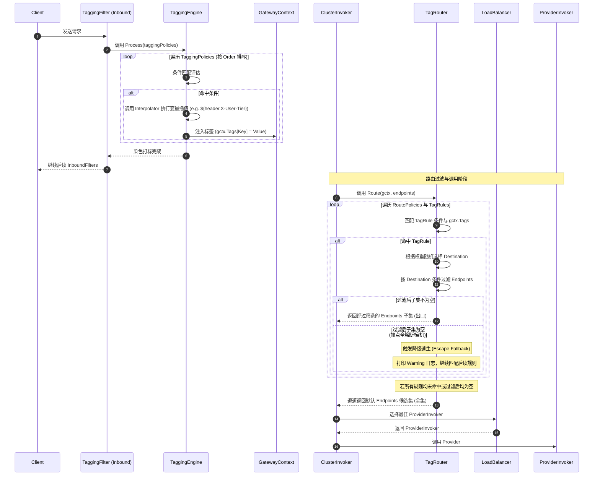

###### TagRouter 执行流程与降级逃生判定

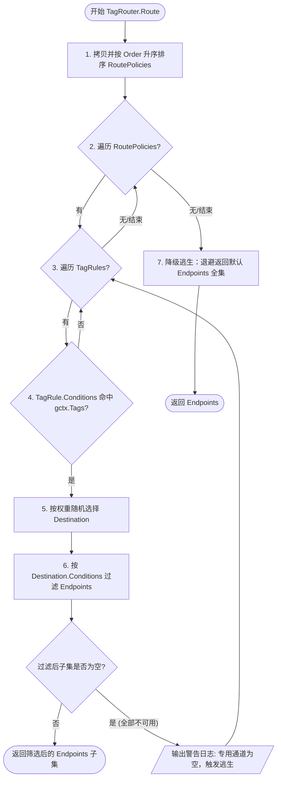

###### 核心逻辑步骤描述

###### A. 染色处理 (TaggingEngine)

1. 在入站过滤器链的 `TaggingFilter` 中，调用 `TaggingEngine.Process()`。
2. 引擎拷贝并按 `Order` 升序对 `TaggingPolicies` 进行稳定排序。
3. 遍历策略并使用 `matcher.DefaultTagMatcherFactory` 对条件进行匹配：
   - 支持前缀、后缀、正则、包含、等于等匹配操作。
   - 对于空条件默认判定为命中。
4. 若条件满足，解析并计算对应的 `Actions`。对于带占位符的 `Value`，调用 `Interpolator` 进行变量插值，并最终写入到运行时上下文 `gctx.Tags` 中。

###### B. 路由处理 (TagRouter)

1. 请求进入 `ClusterInvoker`，其路由链中的 `TagRouter` 拦截候选 `Endpoints` 集合。
2. 路由选择器按 `Order` 从小到大排序 `RoutePolicies` 及其内部的 `TagRules`。
3. 遍历 `TagRules`，提取其 `Conditions` 并匹配 `gctx.Tags`。
4. **加权随机分流 (selectDestination)**：
   - 收集规则中所有 `Destinations`。
   - 根据 `Weight` 字段进行轮盘赌加权随机，选中某一个 `Destination`。
5. **端点元数据过滤 (filterEndpoints)**：
   - 使用被选中 `Destination` 的 `Conditions`，匹配候选 `Endpoint` 的 `Metadata`（例如 `endpoint_tier = premium`）。
   - 筛选出满足过滤条件的端点子集，并立即返回作为后续负载均衡器的输入候选列表。

###### C. 降级逃生机制 (Escape Fallback)

在多租户/高可用场景下，专用通道（如 VIP 独占端点）可能由于熔断或宕机导致没有可用的 Endpoint 实例。

1. 当 `filterEndpoints` 筛选出的子集长度为 `0` 时，`TagRouter` 会自动触发降级逃生。
2. 引擎不会直接报错阻断请求，而是打印 `Warning` 告警日志，提示“专用路由通道为空，触发降级逃生”。
3. 路由器会跳过当前规则，并向下评估同级或后续较低优先级的路由规则。
4. 如果所有的匹配路由规则过滤后子集都为空，或者无规则匹配，`TagRouter` 最终会**退避回默认端点候选列表 (全集)**，由下游的负载均衡和重试保障服务的可用性，实现最大可能的在线保障。

### 7.3 ErrorMatcher（共享原语）

```go
type ErrorMatcher struct {
    StatusCodes      []int
    ErrorCodes       []string
    MessagePatterns  []string  // regex
}

// 各策略的 rule 嵌入 ErrorMatcher
type RetryRule struct {
    Matcher ErrorMatcher
    Retry   bool
}

type CircuitBreakerRule struct {
    Matcher ErrorMatcher
    Failure bool
}

type FallbackRule struct {
    Matcher  ErrorMatcher
    Fallback bool
}
```

各策略**独立维护 error_rules**，互不影响：

- retry 命中 → ClusterInvoker 重试
- circuit_breaker 命中 → cbManager 计入失败统计
- fallback 命中 → FallbackInvoker 切下一个 model
- 限流：**不依赖错误识别**，失败 refund 是无条件二元（`ctx.Err != nil` → refund）

### 7.4 Pipeline 与 Policy 解耦设计 (方案C)

网关遵循**机制与策略分离**的核心设计模式，将管线拓扑机制与具体治理策略进行了彻底解耦：

- **机制层 (Pipeline & Filters)**：仅按照请求接口/能力类型 (`RequestType`) 静态声明通用管线。例如所有聊天请求共享 `chat_completion` 管道，所有嵌入请求共享 `embedding` 管道。Pipeline 从 YAML 配置启动时 eager 构造，数量极少（2-3 个），不从 Redis 拉取。
- **策略层 (Policies)**：与具体模型、用户绑定的精细化流控、重试次数、LB 策略等，由 `PolicyMatcher` 按 model+user 维度运行时从 Redis 查找并字段级合并，注入 `gctx.Policy`。Invoker 和 Filter 从 gctx 读取策略参数。

**Invoker 动态化与并发安全**：
ClusterInvoker 是持久单例壳（持有上游服务的 LB 状态、熔断器 CB 状态），但其 retry 次数、LB 策略选择等参数每请求从 `gctx.Policy` 动态读取。ClusterInvoker 内部持有所有 LB 策略实例的 map。

- **并发安全**：诸如最少连接（least_connections）、最低延迟（least_latency）等有状态 LB 策略，其度量状态（如并发数、平均延迟计数器）与具体的 `Endpoint` 实例绑定（使用 atomic 原子操作或读写锁），LB 策略计算实例本身保持无状态与并发安全。

**动态结算与退款设计**：
在 Fallback 跨模型降级或多次重试的场景下，预扣限流按 `gctx.OriginalModel` 执行，但实际结算时，`TokenSettlementFilter` 会读取 `gctx.SelectedEndpoint` 真正成功执行的 `Model` 标识，并基于 `gctx.Policy` 中的动态计费单价进行高精度的 refund/incr 差额退款结算，从而完全适配降级带来的费率变动。

**完整请求流程**：

```
Gin Middleware: auth（通过 Redis+本地二级缓存验证 API Key → 提取 UserID → X-User-ID Header 注入）
  → Gin LLM Handler → Engine.HandleRequest
    → AcquireContext（解析 model/stream/type）
    → matchPipeline（按 RequestType 选 Pipeline）
    → PolicyMatcher.Match(gctx)（从内存 O(1) 极速匹配策略 → 字段级合并注入 gctx.Policy）
    → InboundFilters: auth(授权) → rate_limit(读策略预扣) → validate
    → ClusterInvoker（并发安全地读 gctx.Policy 动态选 retry/LB/...）
    → OutboundFilters: settlement(读取实际执行 model 动态扣费结算) 
    → logging
```

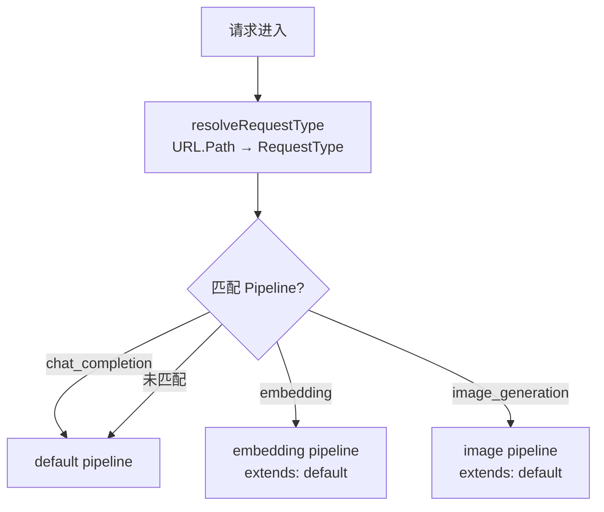

#### 7.4.1 Pipeline 匹配规则

```go
func (e *Engine) matchPipeline(rt RequestType) *Pipeline {
    if p, ok := e.pipelines[string(rt)]; ok {
        return p
    }
    return e.pipelines["default"]  // 兜底
}
```

每种 `RequestType` 最多匹配一个 pipeline，配置校验阶段强制约束。

#### 7.4.2 Policy 匹配与多级覆盖合并规则

网关在运行时通过 `PolicyService` 多级回源加载原始策略，并调用包级单例 `core.DefaultPolicyMatcher` 完成内存合并：

1. **六级回源优先级（自底向上，低优先级到高优先级）**
   策略匹配遵循以下六级优先级维度，高优先级维度中配置的字段将覆盖低优先级的同名非空字段：
   - **Level 5 (最高优先级): User + Model (用户特定模型规则)** — 特定用户的特定模型治理规则（从 Redis 读 `aigw:policies:user:<userID>` 哈希表里的 `<model>` 字段）。
   - **Level 4: Tenant + Model (租户特定模型规则)** — 特定租户的特定模型治理规则（从 Redis 读 `aigw:policies:tenant:<tenantCode>` 哈希表里的 `<model>` 字段）。
   - **Level 3: Model (模型级公共规则)** — 模型的公共默认治理规则（从 Redis 读 `aigw:policies:model:<model>` 哈希表里的 `*` 字段）。
   - **Level 2: User (用户级通配规则)** — 用户的通用治理规则（从 Redis 读 `aigw:policies:user:<userID>` 哈希表里的 `*` 字段）。
   - **Level 1: Tenant (租户级通配规则)** — 租户的通用治理规则（从 Redis 读 `aigw:policies:tenant:<tenantCode>` 哈希表里的 `*` 字段）。
   - **Level 0 (最低优先级): 全局通配 (Global)** — 系统的全局兜底规则（从 Redis 读 `aigw:policies:global` 哈希表里的 `*` 字段）。

   默认优先级链条顺序（升序）配置为：`["global", "tenant", "user", "model", "tenant_model", "user_model"]`。
   若 Redis 实例不可用或未配置相关维度的策略，则回源降级使用本地 YAML 静态规则（`localPolicies`，作为冷启动容灾兜底）参与 Match 合并。

2. **Redis 聚合查询机制**
   为了最大化减少 Redis 请求 of RTT 消耗，`PolicyService` 采用了一次性 Hash 聚合查询：
   - 若 `userID` 非空，一次性通过 `HGetAll` 查询 `aigw:policies:user:{userID}` 获取该用户的所有策略信息，解析出 `user_model` (Level 5) 与 `user` (Level 2)。
   - 若 `tenantCode` 非空，一次性通过 `HGetAll` 查询 `aigw:policies:tenant:{tenantCode}` 获取该租户的所有策略信息，解析出 `tenant_model` (Level 4) 与 `tenant` (Level 1)。
   - 模型公共规则 `model` (Level 3) 与全局通配规则 `global` (Level 0) 分别通过 `HGet` 进行单键查询。

3. **双轨本地二级缓存机制**
   网关为了抵御高并发下的 Redis I/O 压力并防止缓存击穿与雪崩，在 `PolicyService` 中配置了本地二级缓存：
   - **正向缓存 (`validCache`)**：使用 `golang-lru/v2/expirable` 缓存已成功合并的策略对象，容量 `10,000`，过期时间 `30秒`。
   - **负向缓存 (`invalidCache`)**：缓存匹配失败、策略不存在或非法的错误信息，容量 `5,000`，过期时间 `10秒`，防止非法请求持续穿透压垮 Redis。

4. **字段级覆盖与零值语义合并**
   合并算法采用自底向上（从 Level 0 到 Level 5）的指针非 nil 覆盖：
   - `MaxRetries`、`LBStrategy`、`Permissions` 字段：如果高优先级对象中的该指针不为 `nil`，则整体覆盖低优先级的值；如果为 `nil`，则继承低优先级的值。从而消除了 Go 零值（如 `0`、`""`）在合并时的二义性。
   - `LimitPolicies`（限流）、`RoutePolicies`（动态路由）、`CircuitBreakPolicies`（熔断）、`TaggingPolicies`（染色）列表：使用基于名称匹配（Name-based Merge）的深度合并。
   - `RateLimitPolicy` 限流字段（`QPS`、`RPM`、`TPM`）：细化到具体子字段进行合并，子字段的高优先级 non-nil 指针覆盖低优先级指针。

5. **Permissions 授权模型列表兜底补充**
   当最终合并出来的策略的 `Permissions` 列表为空时，为防止下游的 `AuthFilter` 误阻断，`PolicyService` 将触发动态授权补充逻辑：
   - 若 `userID` 存在，调用 Redis 的 `SMembers(ctx, "aigw:user:{userID}:models")` 获取该用户授权的模型列表。
   - 若上一步返回为空且 `tenantCode` 存在，调用 Redis 的 `SMembers(ctx, "aigw:tenant:{tenantCode}:models")` 获取该租户授权的模型列表。
   - 若获取到有效的授权模型列表，则填充给 `merged.Permissions`。
   - 若上述均未配置或 Redis 不可用，则最终将 `Permissions` 兜底为 `["*"]`（全量开放模式）。

#### 7.4.3 ApiKey / Model / Policy 业务服务层设计

为将核心的 Pipe/Filter 运行期效率与底层的 DB/缓存操作隔离开，系统在 `internal/service/` 下设计了三个关键的业务服务：

- **ApiKeyService (`internal/service/apikey.go`)**：
  - **职责**：API Key 的身份验证（AuthN）。
  - **双轨 LRU 本地缓存**：利用 `golang-lru/v2/expirable` 实现。
    - **正向缓存**：存储验证通过的 `ApiKeyInfo`（容量 10,000，TTL 30s）。
    - **负向缓存**：存储失效、禁用的 Key 错误信息（容量 5,000，TTL 10s），防止非法 Key 恶意穿透压垮 Redis。
  - **校验逻辑**：校验 Key 的 status 是否正常（status=1）以及是否过期。

- **ModelService (`internal/service/model.go`)**：
  - **职责**：特定模型对于特定用户的可用性校验（防刷防扣费）。
  - **校验规则**：
    - 若未指定 `userID` 或 Redis 宕机，自动退避（fallback）至本地 YAML `models` 进行格式化校验。
    - 若 Redis 存在键 `aigw:user:<userID>:models`，则调用 `SIsMember` 判断该 model 是否在可用列表中。在此模式下，如果 `SIsMember` 返回 0 则**直接判定为非法模型拒绝请求**，不再进行 YAML 兜底以确保最高安全等级。

  > **接入方式**（v2.6 起）：`GET /v1/models` HTTP 路由由 `LLMHandler.ListModels` 直接处理，
  > 数据源为 Redis SET `aigw:user:{userID}:models`，**不再调用 `engine.HandleRequest`**。
  > 该接口的语义是"返回当前 API Key 授权的模型列表"，而非透传聚合上游 `/models`。
  >
  > `model_list` Pipeline 与 `BroadcastInvoker` 作为 Engine 内部能力**保留**，
  > 可用于后续"网关侧聚合上游 /models 配置同步"等内部任务，但当前外部 HTTP 路由不再触发。

- **PolicyService (`internal/service/policy.go`)**：
  - **职责**：多级策略的懒加载与聚合，满足 `policy.PolicyProvider` 契约。
  - **缓存设计**：提供 30s 的正向本地缓存与 10s 的负向缓存。
  - **交互流**：当请求带来未命中的 user/model 时，回源聚合 Level 0 到 Level 3 的 Redis 原始 Policy，再由 `DefaultPolicyMatcher.Match` 进行合并并塞入本地缓存，下次请求 O(1) 极速读取。

### 7.5 Pipeline extends（浅合并）

对于机制层（Pipeline 结构）的声明继承，系统依然支持 `extends` 浅合并：

```yaml
embedding:
  extends: default
  request_types: [embedding]
  inbound_filters: ["auth", "validate"] # 覆盖 default 的 inbound_filters (不包含 ratelimit 过滤)
  # 未声明的 outbound_filters / invoker 继承 default
```

理由：浅合并语义清晰（"整块继承或整块覆盖"），避免了精细字段合并产生的合并路径不透明性。

---

## 8. 关键运行机制

### 8.1 双层熔断状态机与动态熔断策略

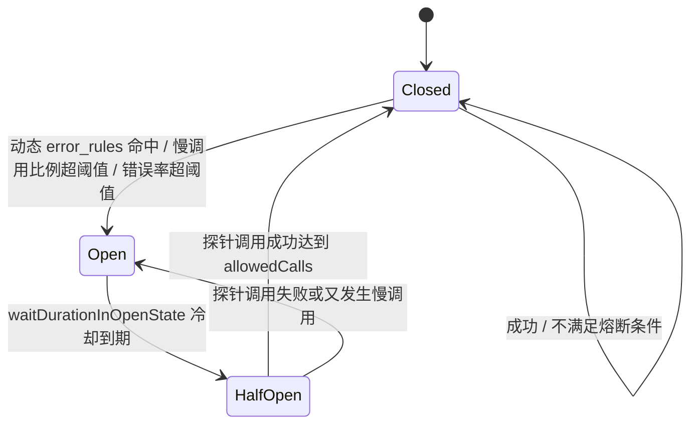

**双层独立运行与动态策略注入：**

网关在运行时通过 `PolicyMatcher` 匹配出的策略中提取并动态应用熔断参数（如滑动窗口大小、最小调用数、恢复超时等），彻底消除硬编码，提升可定制性。

| 维度 | Service-Level | Instance-Level |
|------|--------------|----------------|
| Key | `provider:model`（如 `openai:gpt-4`） | `endpoint.ID` |
| 含义 | 整个 provider+model 服务不可用 | 单个 endpoint 物理节点故障 |
| 触发后影响 | 该 model 所有 endpoint 都被过滤 | 仅该 endpoint 节点被过滤 |
| 配置项来源 | `gctx.Policy.CircuitBreakPolicies` 里的 `SERVICE` 级策略 | `gctx.Policy.CircuitBreakPolicies` 里的 `INSTANCE` 级策略 |
| 慢调用熔断 (TTFT) | 支持首字延迟慢调用比率熔断（如超过 3s） | 支持实例响应慢调用熔断 |
| 错误降级响应 | 熔断或过滤致空时支持 OpenAI 兼容降级响应 | 切回默认候选逃生 / 自动容灾重试 |

**TTFT 慢调用熔断实现：**
当 `CircuitBreakPolicy` 配置 `slowCallMetric: "TTFT"` 时，在 `ClusterInvoker.Invoke` 请求执行成功后，网关会检查首包到达延迟 `gctx.TTFT`。如果 `gctx.TTFT` 超过策略中配置的 `slowCallDurationThreshold`（单位：毫秒），即便 HTTP 状态码为 200，网关也会判定其为一次慢调用，将该请求判定为“熔断失败”，并调用 `cbManager.RecordFailure` 进行指标累加，进而触发慢调用比例熔断。

**OpenAI 兼容降级错误响应：**
当请求因为熔断触发、路由过滤致空等原因无法被正常路由时，网关读取策略中的 `degradeConfig` 降级配置。若配置 `type: "OPENAI_ERROR"`，网关会统一拦截错误并转换为标准的 OpenAI JSON 错误体，提供 `ResponseCode` 和自定义的 `ErrorMessage` 响应：

```json
{
  "error": {
    "message": "All upstream providers are currently unavailable due to circuit breaking.",
    "type": "gateway_error",
    "code": "service_unavailable"
  }
}
```

**读写分离的统一路由与熔断记录：**

- **读过滤**：由 `CircuitBreakerRouter` 在 `ClusterInvoker` 路由链第三阶段执行，根据 cbManager 状态排除已熔断的 Endpoint 候选集。
- **写更新**：在 `ClusterInvoker` 完成调用 attempt 或 TTFT 慢调用校验后，调用 `cbManager.RecordSuccess` 或 `RecordFailure` 异步更新状态机。

**滑动窗口（非固定桶）：** 采用进程内本地内存切片，利用 Slice 自动滑动截断管理。

### 8.2 限流：投机预扣 + 精确结算

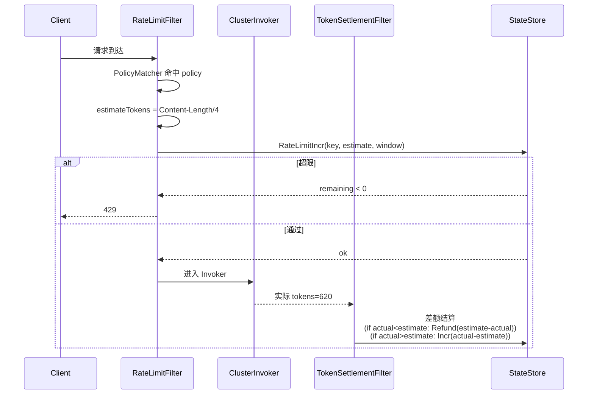

**Key 维度：** PolicyMatcher 命中后用 policy_id 作为 key 前缀，结合 match 字段拼出完整 key。

### 8.3 错误分类与多层处理

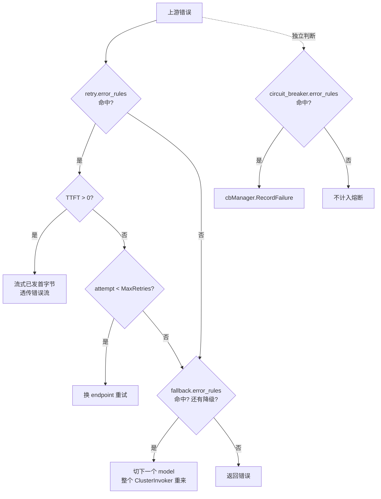

**三套 error_rules 独立运行，互不耦合。**

### 8.4 流式响应与第一字节边界

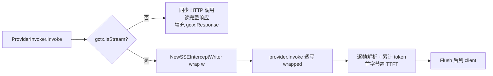

**SSEInterceptWriter：**

```go
type TokenExtractor func(data string) (promptTokens, completionTokens int)

type SSEInterceptWriter struct {
    http.ResponseWriter
    gctx           *GatewayContext
    parser         *SSEParser
    firstByte      bool
    tokenExtractor TokenExtractor  // nil = 默认 OpenAI 格式提取
}

func (w *SSEInterceptWriter) Write(p []byte) (int, error) {
    if !w.firstByte {
        w.firstByte = true
        w.gctx.TTFT = time.Since(w.gctx.StartTime)
    }
    events := w.parser.Feed(p)
    for _, ev := range events {
        var pt, ct int
        if w.tokenExtractor != nil {
            pt, ct = w.tokenExtractor(ev.Data)
        } else {
            pt, ct = ev.PromptTokens, ev.CompletionTokens
        }
        if pt > 0 || ct > 0 {
            w.gctx.PromptTokens = pt
            w.gctx.CompletionTokens = ct
        }
    }
    return w.ResponseWriter.Write(p)
}
```

**TokenExtractor 扩展点：**

OpenAI 格式为默认提取器（`OpenAITokenExtractor`），解析 `{"usage":{"prompt_tokens":N,"completion_tokens":N}}`。
Anthropic 格式通过 `AnthropicTokenExtractor` 提供，解析 `message_start`（input_tokens）和 `message_delta`（output_tokens）事件。
自定义 TokenExtractor 通过 `WithTokenExtractor(te)` 选项注入，用于未来扩展新 Provider 格式。

```go
// OpenAI（默认，无需显式传入）
writer := NewSSEInterceptWriter(gctx)

// Anthropic（Provider 自行提取 token，SSEInterceptWriter 仅提供 TTFT + Flush）
writer := NewSSEInterceptWriter(gctx)
```

**测试侧：** `httptest.ResponseRecorder` 不支持 Flush，包一层 mock Flusher 适配。

**ClusterInvoker 在 retry 前检查：** `if gctx.TTFT > 0 { return err }`。

### 8.5 Token 估算与精度差额结算

```mermaid
flowchart TD
    Start([1. 请求进入网关]) --> MatchPolicy[2. PolicyMatcher 匹配限流策略 LimitPolicy]
    
    subgraph Inbound ["Inbound 阶段 (RateLimitFilter)"]
        MatchPolicy --> TokenEstimate{3. 是否指定 Estimator?}
        TokenEstimate -->|length_ratio| CalcRatio[按字符数比例估算]
        TokenEstimate -->|tiktoken| CalcTiktoken[本地精确分词估算]
        TokenEstimate -->|否 (兜底)| CalcDefault[len/RawBody / 4 粗估]
        
        CalcRatio --> CalcPreToken[计算预估 PromptTokens & 预估费用 estimateCost]
        CalcTiktoken --> CalcPreToken
        CalcDefault --> CalcPreToken
        
        CalcPreToken --> PreDeduct[4. StateStore.RateLimitIncr 预扣 Token 和费用]
        PreDeduct --> CheckLimit{5. 是否超限?}
        CheckLimit -->|是| Reject[返回 429 Too Many Requests]
        CheckLimit -->|否| Invoke[6. 执行 ClusterInvoker 并发送请求给上游]
    end
    
    Invoke --> UpstreamResponse[7. 上游返回响应 & 累计 Token 消耗]
    
    subgraph Outbound ["Outbound 阶段 (TokenSettlementFilter)"]
        UpstreamResponse --> ExtractActual[8. SSEInterceptWriter/Handler 提取实际 usage]
        ExtractActual --> CalcActualCost[计算实际 actualCost = actualPrompt*inputPrice + actualCompletion*outputPrice]
        CalcActualCost --> CalcDiff[9. 计算费用与 Token 差额 delta = actualCost - estimateCost]
        CalcDiff --> Compare{10. 差额判断}
        Compare -->|delta < 0 (实际 < 预扣)| Refund[11. StateStore.RateLimitRefund 退还多扣除的配额]
        Compare -->|delta > 0 (实际 > 预扣)| Additional[11. StateStore.RateLimitIncr 追加扣减超发额度]
        Compare -->|delta = 0| Done[12. 结算完成]
        
        Refund --> Done
        Additional --> Done
    end
    
    Done --> End([响应客户端])
```

网关在入站请求限流前，会对 Prompt 产生的 Token 数量进行初始估算（预扣限流使用）。估算机制与结算已全面策略化：

1. **策略化估算配置 (`estimator`)**：在限流策略 `LimitPolicy` 中支持配置估算器类型。
   - `length_ratio`：基于字符数进行固定比率换算。可以为不同语言模型指定比例（如中文模型 `ratio` 配置为 `0.5`，代表每字节/字符相当于 0.5 Token）。
   - `tiktoken`：在未来可注册特定的本地分词器进行精确 Token 计算。
   - **兜底方案**：若限流策略未指定特定 `estimator`，网关自动退避至 `len(RawBody) / 4` 进行粗估。

2. **精度差额补偿（多退少补）**：
   在 OutboundFilter 阶段（由 `TokenSettlementFilter` 承载，类型为 `Critical`）拦截实际响应，取得上游返回的真实消耗 Token 数，按策略单独计算预扣估算与真实消耗的差额。
   - 如果**实际消耗 < 预扣估算**，网关计算差额并向 Redis/Memory 发起 `RateLimitRefund` 退款，退还多扣除的配额；
   - 如果**实际消耗 > 预扣估算**，网关将向 Redis/Memory 发起 `RateLimitIncr` 追加扣减，保证高精度与账户限流的严密性。

### 8.6 消费额度（Cost）限流器设计

为支持更高级别的商业化治理，网关落地了**消费额度限流器（Cost Limiter）**，允许以“费用预算”为维度控制请求额度：

1. **计费单价模型 (`BillingPolicy`)**：
   在 `Policy` 中新增 `billing` 属性（包含 `inputPrice` 与 `outputPrice`，单位为“厘/1000 Tokens”）。
2. **高精度整型结算**：
   为了规避浮点数在并发和多窗限流累加时的累积精度误差，`CostLimitExecutor` 统一将费用换算为以**“厘”**为整型单位的小数倍整型进行累加与滑动窗口限流：
   - 估算费用：`estimateCost = estimatePromptTokens * inputPrice`（底层通过厘/1000 Tokens 自动推导，内部计算为整型值）。
   - 实际费用：`actualCost = actualPromptTokens * inputPrice + actualCompletionTokens * outputPrice`。
3. **多窗滑动限流**：
   支持在 `LimitPolicy` 的 `slidingWindows` 中配置多窗口（例如 QPS 级小窗 + 日/周/月级费用限流大窗）。在 Inbound 阶段执行 `CostLimitExecutor` 预扣费，超限触发 `429 Too Many Requests`，在 Outbound 阶段通过 `TokenSettlementFilter` 进行差额结算与多退少补。

---

## 9. 可观测性

### 9.1 指标分层

| 层次 | 采集点 | 实时性 |
|------|--------|--------|
| **请求级** | MetricsFilter（OutboundFilter） | 请求完成后立即写 |
| **尝试级** | ClusterInvoker 每次 RecordAttempt 后 | 每次 attempt 立即写（后续可优化为进程内异步事件总线） |
| **基础设施级** | 各组件直接写 | 实时 |

### 9.2 核心 Prometheus 指标

```
# 请求级
gateway_request_duration_seconds{model, provider, status, stream}        histogram
gateway_request_total{model, provider, status, stream}                   counter
gateway_tokens_total{model, provider, type=prompt|completion}            counter
gateway_token_cost_total{model, provider}                                counter (float)

# 尝试级
gateway_attempt_duration_seconds{model, provider, endpoint, status_code} histogram
gateway_attempt_total{model, provider, endpoint, status_code, retry}     counter
gateway_ttft_seconds{model, provider, endpoint}                          histogram

# 基础设施级
gateway_circuit_breaker_state{provider, endpoint, level=service|instance} gauge
gateway_ratelimit_remaining{policy_id, dimension}                         gauge
gateway_compensation_queue_depth{queue=main|delayed|dlq}                  gauge
gateway_discovery_instances{provider}                                     gauge
gateway_compensation_enqueue_failed_total                                 counter
```

**维度控制原则：** label 只用低基数字段（model / provider / endpoint / status）。**绝不**用 apikey、user_id、session_id 做 label —— 放结构化日志。

### 9.3 结构化日志（zap）

复用项目现有 `pkg/log/` 封装。Engine 层日志只传标准 `context.Context`，不依赖 Gin。

**AccessLog 格式（JSON）：**

```json
{
  "ts": "2026-05-23T10:00:00Z",
  "request_id": "uuid",
  "original_model": "gpt-4",
  "model": "gpt-3.5-turbo",
  "provider": "openai",
  "stream": true,
  "status": 200,
  "latency_ms": 1234,
  "ttft_ms": 89,
  "prompt_tokens": 500,
  "completion_tokens": 120,
  "cost": 0.0234,
  "attempts": 2,
  "fallback_chain": ["gpt-4", "gpt-3.5-turbo"],
  "api_key_id": "ak_xxx",
  "user_id": "u_123",
  "session_id": "sess_abc",
  "error": null
}
```

### 9.4 指标 vs 日志的分工

| 数据 | 去向 |
|------|------|
| 请求延迟、QPS、错误率、token 总量 | Prometheus |
| 单次请求的完整链路（apikey、user、session、每次 attempt 详情、fallback 路径） | 结构化日志 |
| 熔断状态变更、限流拒绝、补偿队列操作 | 日志 + 指标 counter |

---

## 10. 生命周期与配置热加载

### 10.1 Engine 结构

```go
type Engine struct {
    config          *EngineConfig          // 配置（当前为直接指针，热加载待迁移至 atomic.Value）
    discovery       Discovery
    pipelines       map[string]*Pipeline
    stateStore      StateStore
    logger          *zap.Logger
    filterRegistry  map[string]interface{}  // Filter 注册表（RegisterFilter 注册，Init 时按名查找）
    routerFactories map[string]RouterFactory       // Router 工厂注册表
    lbFactories     map[string]LoadBalancerFactory  // LB 工厂注册表
    mu              sync.RWMutex           // 保护 filterRegistry / pipelines / factories

    // 生命周期
    ctx    context.Context
    cancel context.CancelFunc

    // 可选组件（通过 setter 注入）
    compQueue       compensation.Queue        // 补偿队列（Redis 可用时注入）
    providers       map[string]Provider       // Provider 实现（HealthCheck 用）
    staticDiscovery *discovery.StaticDiscovery // 静态发现（HealthCheck 更新健康状态用）
}
```

### 10.2 当前启动编排（Wire DI）

```
1. config.NewConfig(path)                    — Viper 加载 YAML
2. log.NewLog(conf)                          — zap 日志初始化
3. wire.NewGatewayEngine(v, logger)          — 构建 Engine（三种配置格式分支）：
   ├─ [新格式] v.IsSet("models")
   │   ├─ config.Load(v) + config.Validate(gwCfg)   — 加载 model-centric 配置 + 校验引用完整性
   │   ├─ config.NewRedisConfigSource(...)            — Redis 配置源（可选，data.redis 存在时）
   │   ├─ config.NewConfigManager(yaml, redis, log)  — 分层配置管理器
   │   ├─ buildFromRelationalConfig(gwCfg)           — 构建 EngineConfig + Provider 实例
   │   ├─ registerEndpointsFromResolvedEndpoints(...) — 注册端点到 StaticDiscovery
   │   └─ go configMgr.StartRedisPolling(ctx)        — 后台版本轮询（Redis 可用时）
   ├─ [旧格式] v.IsSet("gateway") / v.IsSet("llm")
   │   └─ 原有逻辑不变
   ├─ wire.NewGatewayDataStores(v)           — 读 data.redis，有则创建共享 *redis.Client（StateStore + CompQueue），无则 MemoryStateStore
   ├─ core.NewDiscoveryAdapter()             — ServiceInstance → Endpoint 适配
   ├─ core.NewEngine(config, discovery, stateStore, logger)
   ├─ engine.SetCompQueue / SetProviders / SetStaticDiscovery
   ├─ engine.RegisterRouterFactory(...)      — 注册 Router 工厂（API / tag / circuit_breaker）
   ├─ engine.RegisterLoadBalancerFactory(...) — 注册 LB 工厂（8 种策略）
   ├─ engine.RegisterFilter(...)             — 注册 Inbound/Outbound Filter（8 个）
   ├─ engine.Init()                          — 从配置构建 Pipeline + Filter 链
   ├─ engine.StartHealthCheck(ctx, 30s)      — 后台 goroutine 定时探活所有 Provider
   └─ go startPolicySyncLoop(ctx, matcher)   — 后台 goroutine 每 30s 从 Redis 拉取策略（Redis 可用时）
4. handler.NewLLMHandler(engine)             — Gin Handler 薄适配器
5. server.NewHTTPServer(...)                 — Gin + 路由注册
6. app.Run(ctx)                              — HTTP Server 启动
```

> **与设计目标的差异**：配置热加载已通过 Redis 懒加载 + 版本轮询部分实现（ADR-0004/0005）。`engine.UpdateConfig()` 方法已预留，待接入 ConfigManager 实现原子 Pipeline 切换。补偿队列、HealthCheck、PolicyMatcher 热更新均已集成。

**fail-fast 校验项：**

- 配置解析失败 → 退出
- 必填字段缺失 → 退出
- Provider 工厂未注册 → 退出
- default pipeline 缺失 → 退出
- endpoint 引用了不存在的 provider 或缺少必填字段 → 退出（config.Validate）
- 无 endpoint 的 model 静默忽略，不报错
- 循环 fallback → 退出
- 同一 RequestType 被多个 pipeline 声明 → 退出
- filter 未注册 → 退出

**异步连通性校验：**

- `engine.StartHealthCheck(ctx, 30s)` 启动后台 goroutine，每 30s 对所有 Provider 调 `HealthCheck(ctx)`
- 成功 → `StaticDiscovery.UpdateHealthAll(name, Healthy)` + FailureCount 归零
- 失败 → `StaticDiscovery.UpdateHealthAll(name, Unhealthy)` + FailureCount++ + warn 日志
- 不阻塞启动，goroutine 随 `engine.Close()` → `cancel()` 优雅退出

### 10.3 优雅关闭

监听 `SIGTERM` / `SIGINT`，由 `pkg/app/` 统一管理。

```
1. 收到信号 → context.Cancel
2. 各 Server.Stop(ctx)    — 停止 HTTP Server / Job Server
3. Wire cleanup()         — 调用 engine.Close()
   ├─ engine.cancel()     — 停止 HealthCheck / PolicySync 后台 goroutine
   ├─ compQueue.Close()   — 关闭补偿队列（RedisQueue 为 no-op）
   ├─ stateStore.Close()  — 关闭 RedisStateStore（关闭共享 *redis.Client）
   └─ discovery.Close()   — 关闭 Discovery
4. Logger.Sync()          — 刷新日志缓冲
```

> **设计目标差异**：配置热加载已通过 Redis 懒加载 + 版本轮询部分实现。`engine.UpdateConfig()` 方法已预留，待接入 ConfigManager。

### 10.4 配置热加载

当前实现的配置热加载机制：

1. **YAML 基线**：启动时加载，保证网关可用
2. **Redis 覆盖**：懒加载 + 动态活跃模型版本轮询 (ADR-0009)
   - 请求到来时，如果内存缓存没有该 model 的数据，通过 Pipeline (1 RTT) 同时读取 `aigw:config:endpoints:<model_name>` 及其当前配置版本并缓存。
   - 后台每 30s（可配置）收集当前内存中已缓存的活跃模型列表，使用 `HMGET` 从 Redis 读取最新版本。版本发生变更的模型被精准清除出本地缓存。
   - 缓存清空后，下次请求重新懒加载拉取最新端点。
3. **原子切换**：`Engine.UpdateConfig()` 替换 Pipelines（已预留，待接入 ConfigManager）

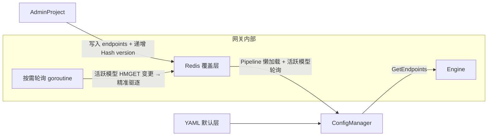

```

> **当前状态**：`engine.UpdateConfig(newConfig)` 方法已实现（`pkg/core/engine.go`），`ConfigWatcher`（fsnotify）已实现但未接入启动流程。容器化环境中优先考虑 Admin API 触发热加载，fsnotify 接入为 future work。Pipeline 级热加载可用，Filter 策略热加载待接入。

**关键约束：**

| 级别 | 可热加载 | 例 |
|------|---------|-----|
| 安全 | ✓ | 限流阈值、熔断参数、路由权重、日志级别 |
| 受控 | ✓ 需校验 | model 列表、Provider 端点、fallback 链 |
| 重启 | ✗ | Redis 地址、监听端口、TLS |

**Provider 热加载：**

- 新增：从 registry 查工厂 → 创建实例 → 语法校验 → 加入 Discovery
- 删除：从 Discovery 移除 → drain 30s → 关闭实例
- 修改配置：创建新实例 → 替换旧实例 → drain 旧实例

**原子性：** `EngineConfig` 整体替换（当前通过 `engine.UpdateConfig()`），不支持单字段 patch，避免中间态。

**Pipeline extends 浅合并** —— 编译期展开（不是运行时合并）。

---

## 11. 代码组织与映射

### 11.1 当前目录布局

```text
tokenlive-gateway/
├── cmd/
│   ├── server/                        # 入口 + wire DI
│   │   └── wire/
│   │       ├── provider.go            # Wire provider 集定义
│   │       ├── wire.go
│   │       └── wire_gen.go
│   ├── migration/
│   │   └── wire/
│   └── task/
│       └── wire/
├── api/
│   └── v1/                            # API 请求/响应类型 + 错误码
│       ├── errors.go
│       ├── user.go
│       └── v1.go
├── pkg/
│   ├── core/                          # 网关核心引擎
│   │   ├── engine.go                  # Engine 结构体 + 生命周期 + HandleRequest
│   │   ├── engine_builder.go          # Pipeline 构建、Router/LB 解析
│   │   ├── engine_request.go          # 请求解析、Pipeline 匹配
│   │   ├── engine_response.go         # 响应写入、错误码提取、Filter 查找
│   │   ├── context.go                 # GatewayContext 池化与生命周期管理
│   │   ├── pipeline.go                # Pipeline 结构
│   │   ├── filter.go                  # InboundFilter / OutboundFilter 接口
│   │   ├── invoker.go                 # Invoker 接口定义
│   │   ├── loadbalancer.go            # LoadBalancer 接口定义
│   │   ├── provider.go                # Provider 接口定义
│   │   ├── circuit_breaker.go         # CircuitBreakerManager 双层熔断管理
│   │   ├── discovery.go               # Discovery 服务发现定义及适配
│   │   └── types.go                   # 核心结构体定义（Endpoint 等）
│   ├── policy/                        # 动态治理策略配置与归并匹配包
│   │   ├── policy.go                  # Policy 核心定义与 PolicyMatcher/MergePolicies 归并算法
│   │   ├── load_balance.go            # 负载均衡策略配置定义
│   │   ├── invoke.go                  # 调用与重试策略配置定义
│   │   ├── limit.go                   # 限流策略配置定义
│   │   ├── route.go                   # 路由匹配规则配置定义
│   │   └── circuit_break.go           # 熔断治理规则配置定义
│   ├── limiter/                       # 令牌桶限流执行器实现
│   │   ├── types.go                   # 限流自定义 HTTPError 定义
│   │   ├── request.go                 # 针对请求数 (QPS/RPM) 的限流执行器
│   │   └── token.go                   # 针对 Token (TPM) 的限流执行器及估算逻辑
│   ├── invoker/                       # 统一调用实现包
│   │   ├── builder.go                 # Invoker 构建工厂
│   │   ├── cluster.go                 # ClusterInvoker（Discovery + Router + 动态 LB + 动态重试）
│   │   ├── fallback.go                # FallbackInvoker（模型多级降级链）
│   │   └── provider.go                # ProviderInvoker（Provider 端点具体调用）
│   ├── filters/                       # 内置 Filter 实现
│   │   ├── auth.go                    # AuthFilter（模型白名单授权 AuthZ）
│   │   ├── session_reader.go          # SessionReaderFilter 粘性会话提取
│   │   ├── limit.go                   # RateLimitFilter（令牌桶限流驱动器）
│   │   ├── validate.go                # ValidateFilter（请求规范与模型合法性校验）
│   │   ├── token_settlement.go        # TokenSettlementFilter（动态扣费与差额结算，Critical）
│   │   ├── sticky_session.go          # StickySessionFilter（粘性会话写入，Critical）
│   │   ├── metrics.go                 # MetricsFilter 指标收集 (BestEffort)
│   │   └── access_log.go              # AccessLogFilter 结构化访问日志 (BestEffort)
│   ├── routers/                       # 内置 Router 路由过滤器实现
│   │   ├── API.go              # APIRouter（能力匹配过滤）
│   │   ├── tag.go                     # TagRouter（路由标签过滤）
│   │   └── circuit_breaker.go         # CircuitBreakerRouter（熔断实例过滤）
│   ├── store/                         # StateStore 状态中心（Redis Lua 脚本原子操作 / 内存）
│   ├── lbs/                           # 负载均衡策略实现（并发安全）
│   ├── llm/                           # LLM 协议层（OpenAI / Anthropic Provider 协议适配及 SSE 拦截）
│   ├── discovery/                     # 服务发现（Static / Kubernetes Discovery）
│   ├── server/                        # 服务器抽象与入口装配
│   ├── log/                           # zap 日志封装
│   ├── config/                        # 配置中心（model-centric 配置与 Redis 定时轮询版本热更新）
│   ├── app/                           # 生命周期与优雅关闭管理
│   ├── compensation/                  # 异常补偿队列（Redis Stream 消费者组 + ZSet 延迟消费）
│   └── zapgorm2/                      # GORM zap 适配器
├── internal/
│   ├── handler/                       # Gin Handler 处理器层
│   ├── middleware/                    # Gin 中间件层，包括 auth.go（API Key 身份校验 AuthN）
│   ├── router/                        # Gin 路由注册
│   ├── server/                        # 启动入口 HTTP/Grpc Server 装配
│   ├── service/                       # 业务服务层
│   │   ├── apikey.go                  # ApiKeyService（双轨本地 LRU 二级缓存 + Redis Hash 校验）
│   │   ├── model.go                   # ModelService（模型访问校验及 YAML 兜底）
│   │   └── policy.go                  # PolicyService（多维策略懒加载聚合）
│   ├── repository/                    # GORM 数据库访问
│   ├── model/                         # 数据模型
│   ├── job/                           # 后台任务定义
│   └── task/                          # 定时任务
├── config/
│   ├── local.yml                      # 本地开发配置
│   ├── prod.yml                       # 生产配置
│   └── llm.example.yml               # LLM 配置示例
├── test/                              # 外部集成测试
│   ├── mocks/                         # gomock 生成的 mock
│   └── server/                        # handler / repository / service 测试
├── deploy/
│   ├── build/Dockerfile
│   └── docker-compose/docker-compose.yml
├── docs/
│   ├── architecture.md                # 本文档
│   └── swagger.{json,yaml}           # Swagger 文档
└── web/
    └── index.html
```

> **设计 vs 实现的差异说明**：
>
> - 核心引擎从 `pkg/gateway/` 改为 `pkg/core/`，语义更通用
> - Filter / Router / LB 实现从 `pkg/gateway/` 子目录提升为 `pkg/` 平级包（`pkg/filters/`、`pkg/routers/`、`pkg/lbs/`）
> - `pkg/llm/` 和 `pkg/llm/providers/` 已实现 OpenAI / Anthropic Provider，含 SSE TokenExtractor 统一
> - `pkg/compensation/` 已实现并集成到 Engine OutboundFilter 主路径（Critical filter 失败自动入队）
> - PolicyMatcher 已改为 `atomic.Pointer` 无锁读 + `Update()` 热更新，Redis 可用时定时拉取
> - HealthCheck 已集成：后台 goroutine 每 30s 探活 Provider，更新 StaticDiscovery 健康状态
> - `Engine.Close()` 已实现：cancel → compQueue → stateStore → discovery 有序关闭

### 11.2 代码映射

| 实现位置 | 对应设计 | 状态 |
|----------|---------|------|
| `pkg/core/engine.go` | Engine 结构体 + 生命周期 + HandleRequest | ✅ 已实现 |
| `pkg/core/engine_builder.go` | Pipeline/Invoker 构建、Router/LB 解析 | ✅ 已实现 |
| `pkg/core/engine_request.go` | 请求解析、Pipeline 匹配 | ✅ 已实现 |
| `pkg/core/engine_response.go` | 响应写入、错误码提取、Filter 查找 | ✅ 已实现 |
| `pkg/core/context.go` | GatewayContext + sync.Pool | ✅ 已实现 |
| `pkg/core/pipeline.go` | Pipeline 结构 + 匹配 | ✅ 已实现 |
| `pkg/core/filter.go` | InboundFilter / OutboundFilter 接口 | ✅ 已实现 |
| `pkg/core/invoker.go` | Invoker 接口 | ✅ 已实现 |
| `pkg/core/provider.go` | Provider 接口 + ProviderInvoker | ✅ 已实现 |
| `pkg/core/cluster_invoker.go` | ClusterInvoker | ✅ 已实现 |
| `pkg/core/fallback_invoker.go` | FallbackInvoker | ✅ 已实现 |
| `pkg/core/router.go` | Router 接口 + Excluded filter | ✅ 已实现 |
| `pkg/core/lb.go` | LoadBalancer 接口 | ✅ 已实现 |
| `pkg/policy/` | 动态治理策略配置与归并匹配包（Policy, PolicyMatcher 等） | ✅ 已实现 |
| `pkg/limiter/` | 令牌桶限流执行器实现（QPS/RPM 请求限流与 TPM Token 限流） | ✅ 已实现 |
| `pkg/core/error_matcher.go` | ErrorMatcher 共享原语 | ✅ 已实现 |
| `pkg/core/circuit_breaker.go` | CircuitBreakerManager | ✅ 已实现 |
| `pkg/core/discovery.go` | Discovery 接口 + Adapter | ✅ 已实现 |
| `pkg/core/config_watcher.go` | 配置热加载 | ✅ 已实现 |
| `pkg/core/types.go` | RequestType / Endpoint 等核心共享类型 | ✅ 已实现 |
| `pkg/config/` | Model-centric 配置（types + loader + redis_source + config_manager） | ✅ 已实现 |
| `pkg/filters/` | 全部 8 个内置 Filter（含 SessionReaderFilter） | ✅ 已实现并接入 Engine |
| `pkg/routers/` | API / Tag / CircuitBreaker 三个 Router（原 DynamicRoutePolicy 重命名合并为 TagRouter） | ✅ 已实现 |
| `pkg/lbs/` | RoundRobin / Cost / Sticky / Composite / Random / LeastConn / LeastLatency / WRR | ✅ 已实现（8 种策略全部接入） |
| `pkg/store/` | StateStore 接口 + Memory + Redis + Lua 脚本 | ✅ 已实现 |
| `pkg/discovery/` | StaticDiscovery（含 UpdateHealthAll） + KubernetesDiscovery | ✅ 复用 |
| `pkg/log/` | zap 封装 | ✅ 复用 |
| `internal/handler/llm_handler.go` | Gin 适配器 → `engine.HandleRequest(w, r)` | ✅ 已改写 |
| `internal/middleware/` | 全局中间件（CORS / Auth / Metrics 等） | ✅ 保留 |
| `pkg/compensation/` | 补偿队列（Redis Stream + Consumer Group） | ✅ 已实现（Queue + Worker + 延迟重试 + DLQ） |
| `pkg/llm/providers/` | Provider 协议适配（OpenAI / Anthropic） | ✅ 已实现（含 SSE 统一 TokenExtractor） |
| `internal/service/llm.go` retry+fallback | 已由 ClusterInvoker + FallbackInvoker 替代 | ✅ 已删除 |

---

## 12. 扩展点

| 扩展点 | 接口 | 注册方式 |
|--------|------|---------|
| Provider | `llm.Provider` | `init()` 调用 `llm.RegisterProvider` |
| InboundFilter / OutboundFilter | `core.InboundFilter` / `OutboundFilter` | 工厂注册，YAML 中引用 name |
| Router | `core.Router` | 工厂注册 |
| LoadBalancer | `core.LoadBalancer` | 工厂注册 |
| Discovery | `core.Discovery` | 配置切换 static / kubernetes / consul / ... |
| StateStore | `core.StateStore` | 配置切换 memory / redis（读 `data.redis`，与 CompQueue 共享连接） |
| CompensationQueue | `compensation.Queue` | ✅ 已实现并集成（Redis Stream，Critical OutboundFilter 失败自动入队） |

**新增 RequestType 示例**（以 OpenAI Responses API 为例）：

```go
const RequestTypeResponses RequestType = "responses"

func resolveRequestType(path string) RequestType {
    switch path {
    case "/v1/chat/completions": return RequestTypeChatCompletion
    case "/v1/embeddings":       return RequestTypeEmbedding
    case "/v1/responses":        return RequestTypeResponses   // 新增
    // ...
    }
}

// Provider 声明能力
func (p *OpenAIProvider) RequestTypes() []RequestType {
    return []RequestType{
        RequestTypeChatCompletion,
        RequestTypeEmbedding,
        RequestTypeResponses,                                   // 新增
    }
}
```

无需改动 Engine、ClusterInvoker、Filter 任何代码 —— APIRouter 自动过滤不支持的 endpoint。

---

## 13. 测试策略

### 13.1 单元测试

| 组件 | 测试方式 |
|------|---------|
| InboundFilter / OutboundFilter | mock GatewayContext + mock StateStore |
| Router | 构造候选列表，断言过滤结果（含 TagRouter 全不匹配兜底） |
| ClusterInvoker | mock Discovery / Router / LB / ProviderInvoker，覆盖 retry / failover / circuit-open 分支 |
| FallbackInvoker | mock ClusterInvoker，覆盖降级链 + error_rules 不命中分支 + TTFT>0 不降级 |
| ProviderInvoker | mock HTTP server，覆盖各 Provider 协议格式 + SSEInterceptWriter 流式 |
| StateStore (Memory) | 模拟时钟，验证窗口/桶语义 |
| StateStore (Redis) | miniredis 或 testcontainers，验证 Lua 原子性 |
| CompensationQueue | testcontainers Redis，验证 XAUTOCLAIM 崩溃恢复 |
| SSEInterceptWriter | 注入 mock Flusher writer，验证帧解析 + token 累计 + TTFT |
| PolicyMatcher | 表驱动用例覆盖 5 层维度优先级 |
| ErrorMatcher | 表驱动覆盖各种 status_code / error_code / regex 组合 |

### 13.2 集成 / E2E

启动 mock OpenAI / Anthropic HTTP server。场景：

- 正常 chat / embedding / stream
- 429 限流 → ClusterInvoker failover 透明
- 5xx 连续失败 → instance 熔断 → 30s 后 HalfOpen 探针 → 恢复
- 整 provider 不可用 → service-level 熔断 → fallback 到下一个 model
- Sticky session：同一 SessionID 多次请求落到同一 endpoint
- 流式中途上游断开（TTFT>0）→ 错误透传，不 retry/fallback
- 限流预扣 vs 实际差额结算精度
- Critical OutboundFilter 失败 → 补偿队列 → worker 重放成功
- 补偿任务永久失败 → DLQ
- 配置热加载失败 → 旧配置仍然生效
- Provider 热加载新增/删除 → drain 30s

### 13.3 压测基准

- 单机 1k QPS 非流式 / 200 并发流式，验证内存与 GC
- Redis StateStore 模式下集群水平扩展
- sync.Pool 对 GatewayContext 的内存效益（pprof 对比开/关 pool）

---

## 附录 A：架构决策汇总（191 条）

> 决策按 grilling 顺序编号；同一编号有 `'` 后缀表示后续修订（如 109' 表示 109 的修订版）。

### A.1 顶层架构（1-15）

| # | 决策点 | 结论 |
|---|--------|------|
| 1 | Web 框架 | Gin Shell + Engine Pipeline，Engine 零 Gin 依赖 |
| 2 | Filter 模型 | 三层：Inbound(1x) → Invoker(可重试) → Outbound(1x) |
| 3 | 调用抽象 | Invoker：ProviderInvoker / ClusterInvoker / FallbackInvoker |
| 4 | 服务发现命名 | Discovery（对齐 `pkg/discovery/`） |
| 5 | Router 模型 | 线性 list filter，非洋葱式调用链 |
| 6 | 流式实现 | 阻塞 InvokeStream + SSEInterceptWriter 透明包装 |
| 7 | Provider 接口 | 全新设计，直写 `io.Writer`，无 channel |
| 8 | 入口形式 | 统一 `Invoke(gctx)`，gctx 携带请求类型 |
| 9 | Pipeline 配置 | 按 RequestType 声明 Filter 链（YAML 静态） |
| 10 | 策略配置 | Filter 内按 user/model/apikey 运行时匹配 |
| 11 | 熔断器归属 | ClusterInvoker 写状态，CircuitBreakerRouter 读状态过滤 |
| 12 | 请求解析 | Engine 在 AcquireContext 时轻量解析 model/stream/type |
| 13 | 配置热更新 | Pipeline 结构静态（重启）；策略动态（PolicyMatcher 版本轮询 30s 刷新缓存） |
| 14 | 策略匹配 | 泛型 PolicyMatcher[T]，维度优先级 |
| 15 | 策略执行器 | 工厂模式注册 |

### A.2 Discovery 与模型降级（16-22）

| # | 决策点 | 结论 |
|---|--------|------|
| 16 | Discovery 过滤维度 | 按 model 过滤（微服务"服务名"语义） |
| 17 | 模型降级实现 | 嵌套 Invoker：FallbackInvoker(ClusterInvoker(...)) |
| 18 | 降级链触发条件 | 整个 ClusterInvoker 失败后才切下一个 model（不是单 attempt 失败） |
| 19 | 降级 model 重写 | gctx.Model 可重写；OriginalModel 保留不变 |
| 20 | 流式降级边界 | TTFT > 0 后不再 fallback |
| 21 | 无降级配置 | FallbackInvoker 退化为单 ClusterInvoker 透传 |
| 22 | Provider 扩展性 | API-based：`RequestTypes() []RequestType` + 统一 `Invoke()` |

### A.3 错误识别与策略（23-31）

| # | 决策点 | 结论 |
|---|--------|------|
| 23 | 错误识别归属 | 嵌入各策略（retry/cb/fallback），不做独立 Classifier 策略 |
| 24 | ErrorMatcher 原语 | status_codes / error_codes / message_patterns 共享原语 |
| 25 | 策略独立 error_rules | retry / circuit_breaker / fallback 各自配置 |
| 26 | RetryRule | `{ matcher, retry: bool }` |
| 27 | CircuitBreakerRule | `{ matcher, failure: bool }` |
| 28 | FallbackRule | `{ matcher, fallback: bool }` |
| 29 | RateLimit 错误识别 | **不依赖错误识别**，refund 二元（`ctx.Err != nil` → refund） |
| 30 | 限流 Key 维度 | key_dimensions 从 PolicyMatcher 的 match 字段推导，默认 = match 字段 |
| 31 | 限流策略 Key | 用 policy_id（命中相同 policy 的请求共享 token） |

### A.4 熔断（32-41）

| # | 决策点 | 结论 |
|---|--------|------|
| 32 | 熔断分层 | service-level（provider+model）+ instance-level（endpoint），独立配置 |
| 33 | 接口级熔断 | 不引入（LLM 场景不适合，由 RequestType pipeline 间接达成） |
| 34 | 两层独立性 | 状态、配置、error_rules 完全独立，可以只启用其一 |
| 35 | 熔断滑动窗口 | 滑动窗口（非固定时间桶） |
| 36 | 熔断状态机 | Closed → Open → HalfOpen → Closed/Open |
| 37 | HalfOpen 行为 | 限制并发探针数，成功阈值后回 Closed |
| 38 | Open 时长 | 配置 open_duration，HalfOpen 失败翻倍 |
| 39 | min_requests | 窗口内请求数不足时不触发熔断 |
| 40 | 熔断 Key | service: `provider:model`；instance: `endpoint.ID` |
| 41 | 熔断 Reset | 提供管理 API 强制重置 |

### A.5 GatewayContext（42-59）

| # | 决策点 | 结论 |
|---|--------|------|
| 42 | Context 与重试 | ResetAttempt() 清空 per-attempt 字段 |
| 43 | Attempt 历史 | History 累积，不被 reset 清空 |
| 44 | RecordAttempt | 推入 History + AttemptCount++ |
| 45 | 字段分类 | 请求常量 / 决策结果 / per-attempt / 累积 / 最终结果 |
| 46 | UpstreamResponse | per-attempt（每次重试都新的） |
| 47 | TTFT 保留 | 一旦置位不 reset（影响 retry 判断） |
| 48 | Cost 计算 | 最终结果，由 MetricsFilter 计算 |
| 49 | OriginalModel | 用户原始请求 model，不可变 |
| 50 | Model 可变 | FallbackInvoker 重写 |
| 51 | FallbackChain | 累积，记录降级经过的 model |
| 52 | Policy 携带 | 命中策略后挂在 gctx 上，避免重复匹配 |
| 53 | RawBody | 入口读一次，[]byte 保持 |
| 54 | 不全量反序列化 | 各组件按需用 gjson 提取 |
| 55 | Model 提取时机 | AcquireContext 中提取 |
| 56 | Stream 提取时机 | AcquireContext 中提取 |
| 57 | RequestType 解析 | URL.Path → RequestType |
| 58 | UserID/SessionID | InboundFilter 填充 |
| 59 | APIKey | AuthFilter 填充 |

### A.6 限流与 PolicyMatcher（60-68）

| # | 决策点 | 结论 |
|---|--------|------|
| 60 | 投机预扣 | RateLimitFilter 入口预扣 estimate |
| 61 | 精确结算 | TokenSettlementFilter 差额 refund/incr |
| 62 | Estimate 算法 | Content-Length / 4 |
| 63 | max_prompt_tokens | 显式上限优先于 estimate |
| 64 | Refund 二元 | 失败无条件 refund，不依赖 error_rules |
| 65 | PolicyMatcher 优先级 | 动态合并支持 6 级优先级：user_model > tenant_model > model > user > tenant > global（从低到高依次覆盖合并，Redis 为主数据源，本地 YAML 为冷启动及容灾兜底） |
| 66 | API Key 通配符 | match.api_key 支持 `*` 通配符 |
| 67 | 其他维度 | model、user 精确匹配 |
| 68 | RPM + TPM | 两个独立维度同时生效 |

### A.7 LoadBalancer（69-77）

| # | 决策点 | 结论 |
|---|--------|------|
| 69 | Sticky 定位 | LoadBalancer 策略，不是独立 Router |
| 70 | Sticky 内部包装 | 内含 fallback LB，miss 时落到 fallback |
| 71 | Cost LB | 也是 LB 策略（不是 Router） |
| 72 | Latency LB | 也是 LB 策略（不是 Router） |
| 73 | LB 共 8 种 | RR / WRR / Random / LeastConn / LeastLatency / Cost / Sticky / Composite |
| 74 | Composite | 多维归一化加权评分 |
| 75 | Sticky 读写分离 | LB 读，OutboundFilter(StickySessionFilter) 写 |
| 76 | Sticky Key | 配置 key=session_id / user_id / api_key |
| 77 | Sticky TTL | 配置项 |

### A.8 Router（78-79）

| # | 决策点 | 结论 |
|---|--------|------|
| 78 | TagRouter | 引入 TagRouter 基于动态已染色标签和路由策略规则进行分流，并支持降级逃生机制 |
| 79 | Router 软硬分工 | Router 硬约束（过滤），LB 软选择（排序选一） |

### A.9 Pipeline 与配置校验（80-88）

| # | 决策点 | 结论 |
|---|--------|------|
| 80 | 默认 Pipeline | default pipeline 必须存在 |
| 81 | RequestType 匹配 | 每种 RequestType 最多一个 pipeline |
| 82 | 启动 fail-fast | 配置错误进程退出 |
| 83 | 热加载 fail-safe | 校验失败保留旧配置 |
| 84 | 引用一致性 | 校验 model→provider、fallback→model、pipeline→filter |
| 85 | 循环检测 | 拒绝循环 fallback |
| 86 | 配置原子替换 | 整体 GatewayConfig 替换，不支持单字段 patch |
| 87 | extends 语义 | 浅合并：整块继承或整块覆盖 |
| 88 | filter 注册校验 | 未注册的 filter 启动退出 |

### A.10 Provider 注册与生命周期（89-95）

| # | 决策点 | 结论 |
|---|--------|------|
| 89 | Provider 注册 | `init()` 自注册到 registry |
| 90 | 启动连通性 | 不阻塞，异步 HealthCheck |
| 91 | 异步校验失败 | warn 日志 + HealthStatus=Unknown |
| 92 | Provider 热加载新增 | 从 registry 查工厂 → 实例化 → 加入 Discovery |
| 93 | Provider 热加载删除 | drain 30s → 关闭 |
| 94 | Provider 配置修改 | 新实例替换旧实例 → drain |
| 95 | Drain 默认 30s | 可配置 |

### A.11 OutboundFilter 失败补偿（96-115）

| # | 决策点 | 结论 |
|---|--------|------|
| 96 | OutboundFilter 始终执行 | 即使 Invoke 失败也跑（结算预扣等） |
| 97 | Filter 失败不影响响应 | 流式响应已写出 |
| 98 | 错误日志 | 失败必记日志 + counter |
| 99 | Criticality 分类 | BestEffort / Critical |
| 100 | TokenSettlement | Critical |
| 101 | StickySave | Critical |
| 102 | Metrics | BestEffort |
| 103 | AccessLog | BestEffort |
| 104 | Critical 失败处理 | 入补偿队列 |
| 105 | BestEffort 失败处理 | 仅记错误日志 |
| 106 | 补偿幂等约束 | Critical filter 必须幂等（StateStore dedup_key） |
| 107 | dedup_key | task UUID |
| 108 | 队列消费幂等 | 落到 StateStore（Redis Lua SET NX + INCR） |
| 109' | 队列后端 | Redis Stream + Consumer Group（替代决策 109 的进程内 channel） |
| 110 | 调度器 | 单点选主，扫 delayed ZSet 入队 |
| 111 | Worker | 多消费者，同 group，XREADGROUP 拉取 |
| 112' | 重启恢复 | XAUTOCLAIM 接管 pending，无需独立 disk recovery |
| 113' | DLQ | 单独 Redis Stream（不是 disk 文件） |
| 114 | Redis 实例隔离 | 共享 Redis 集群，key prefix 隔离 |
| 115 | Redis 不可用降级 | 直接丢任务 + 告警，**不**退化到本地内存 |

### A.12 流式响应（116-118）

| # | 决策点 | 结论 |
|---|--------|------|
| 116 | Engine 签名 | 保持 `(http.ResponseWriter, *http.Request)`，测试侧 mock Flusher |
| 117 | SSEInterceptWriter 安装 | Provider 安装（各 Provider 在 handleStream 中创建，支持格式转换如 Anthropic→OpenAI） |
| 118 | 流式 retry 边界 | TTFT > 0 后不可 retry/fallback |

### A.13 可观测性（119-122'）

| # | 决策点 | 结论 |
|---|--------|------|
| 119 | 指标分层 | 请求级（Filter） + 尝试级（ClusterInvoker 直写）+ 基础设施级 |
| 120 | 指标清单 | 9 大类，低基数 label |
| 121 | 指标 vs 日志分工 | 数值聚合走 Prometheus，单请求链路走日志 |
| 122' | 日志库 | 复用项目 `pkg/log/` 的 zap 封装 |

### A.14 配置热加载（123-126）

| # | 决策点 | 结论 |
|---|--------|------|
| 123 | 热加载范围 | 安全 / 受控 / 需重启 三级 |
| 124 | 校验策略 | 启动 fail-fast，热加载 fail-safe |
| 125 | 原子性 | 整体 GatewayConfig 替换 |
| 126 | default pipeline | 必须存在，否则启动退出 |

### A.15 Provider 与 Discovery（127-129）

| # | 决策点 | 结论 |
|---|--------|------|
| 127 | 启动时序 | Provider init → Config → Discovery → Pipeline → Listen |
| 128 | 校验深度 | 启动做语法校验；连通性异步 |
| 129 | 热加载 Drain | 30s 宽限 |

### A.16 GatewayContext 生命周期（130-131）

| # | 决策点 | 结论 |
|---|--------|------|
| 130 | 不实现 context.Context | 强类型 struct，内嵌 Ctx 字段 |
| 131 | sync.Pool 池化 | Engine 入口 Acquire，defer Release |

### A.17 Engine 装配（132-135'）

| # | 决策点 | 结论 |
|---|--------|------|
| 132 | Engine 结构 | 持有 config / discovery / pipelines / stateStore / compQueue / logger / metrics |
| 133 | 启动顺序 | StateStore → CompQueue → Discovery → Pipelines → Watcher → Listen |
| 134 | 关闭顺序 | Server.Shutdown → Watcher → CompQueue → Discovery → StateStore → Logger.Sync |
| 135' | Pipeline 匹配 | 按 RequestType，未匹配走 default |

### A.18 ProviderInvoker 与 Endpoint（136-138）

| # | 决策点 | 结论 |
|---|--------|------|
| 136 | ProviderInvoker 结构 | provider + endpoint + stateStore |
| 137 | Provider.Invoke 职责 | 协议转换 + HTTP 调用，不管 retry/熔断/日志 |
| 138 | Endpoint 命名 | 统一用 Endpoint（Gateway 层视图），从 ServiceInstance 映射 |

### A.19 ClusterInvoker 编排（139'-142）

| # | 决策点 | 结论 |
|---|--------|------|
| 139' | 每 attempt 重跑 Router chain | Discovery → Router → LB 每次循环都跑 |
| 140' | 熔断过滤位置 | 统一在 CircuitBreakerRouter，读写分离（ClusterInvoker 写） |
| 141 | 成功也记录熔断 | 用于 HalfOpen → Closed |
| 142 | 默认 Backoff | exponential_jitter |

### A.20 FallbackInvoker（143-147）

| # | 决策点 | 结论 |
|---|--------|------|
| 143 | FallbackInvoker 结构 | chain []FallbackEntry{ Model, ClusterInvoker } |
| 144 | 触发时机 | retry 全部耗尽后才 fallback |
| 145 | 位置 | InboundFilters → FallbackInvoker → OutboundFilters |
| 146 | Invoker 统一接口 | 三种实现共享 Invoker 接口 |
| 147 | OriginalModel 保留 | gctx.OriginalModel 不可变 |

### A.21 Filter 设计（148-151）

| # | 决策点 | 结论 |
|---|--------|------|
| 148 | Filter 接口 | InboundFilter / OutboundFilter，OutboundFilter 带 Criticality |
| 149 | Inbound 顺序 | Auth(10) → RateLimit(20) → Validate(30) |
| 150 | Outbound 顺序 | TokenSettlement(10) → Sticky(20) → Metrics(30) → AccessLog(40) |
| 151 | CircuitBreakerUpdate 移除 | 熔断更新完全由 ClusterInvoker 内部完成 |

### A.22 StateStore（152'-156）

| # | 决策点 | 结论 |
|---|--------|------|
| 152' | StateStore 接口 | 按功能域拆方法（限流、Sticky、平均延迟），移除熔断接口 |
| 153 | 不通用 KV | 不提供 Get/Set 通用方法 |
| 154 | 双实现 | MemoryStateStore / RedisStateStore |
| 155 | Redis Lua 原子 | 启动时 SCRIPT LOAD 预加载 |
| 156 | 熔断滑动窗口 | 进程内本地内存切片，不属于 StateStore 职责 |

### A.23 完整配置（157-159）

| # | 决策点 | 结论 |
|---|--------|------|
| 157 | 顶层结构 | 见 §7.1 |
| 158 | 环境变量替换 | 支持 `${VAR}` 语法 |
| 159 | extends 浅合并 | 整块覆盖（不做字段级合并） |

### A.24 Router 链最终形态（160-164）

| # | 决策点 | 结论 |
|---|--------|------|
| 160 | Router 接口 | Name() + Route(gctx, eps) |
| 161 | CircuitBreakerRouter 保留 | 统一熔断过滤位置 |
| 162 | APIRouter | 过滤不支持 RequestType 的 endpoint |
| 163 | TagRouter | 标签过滤，全不匹配时放行兜底 |
| 164 | Router chain 顺序 | API → Tag → CircuitBreaker |

### A.25 LoadBalancer 实现（165-170）

| # | 决策点 | 结论 |
|---|--------|------|
| 165 | LB 接口 | Select(gctx, eps) *ProviderInvoker |
| 166 | 八种策略 | RR / WRR / Random / LeastConn / LeastLatency / Cost / Sticky / Composite |
| 167 | Sticky LB | 内含 fallback LB，miss 时落到 fallback；写由 OutboundFilter 完成 |
| 168 | LeastLatency | 读 StateStore 平均延迟 |
| 169 | Cost LB | Endpoint.Metadata.cost_per_token |
| 170 | Composite | 多维归一化加权 |

### A.26 边角细节（171-173）

| # | 决策点 | 结论 |
|---|--------|------|
| 171 | Token 估算 | Content-Length / 4，放在 `pkg/core/`，不引入 tiktoken |
| 172 | RawBody | []byte，各组件按需 gjson 解析 |
| 173 | Model/Stream/RequestType | AcquireContext 中用 gjson 快速提取 |

### A.27 Pipeline 重构与 PolicyMatcher 深化（174-187）

| # | 决策点 | 结论 |
|---|--------|------|
| 174 | Pipeline 构建维度 | per-RequestType（能力），非 per-model。消除 N 份几乎相同 Pipeline 的冗余 |
| 175 | Pipeline 构建时机 | 启动时 eager（2-3 个，成本可忽略），放弃 lazy 构造 |
| 176 | Pipeline 配置来源 | 纯 YAML，不从 Redis 拉取 Pipeline 配置 |
| 177 | Invoker 生命周期 | 持久壳（持有 LB/CB 状态），运行时读 gctx.Policy 注入策略参数 |
| 178 | Policy 数据来源 | Redis 四级优先（user+model → model+"*" → "*"+user → YAML 扁平规则兜底） |
| 179 | Policy 合并语义 | 字段级覆盖——高优先级 non-nil（Go 指针）字段覆盖低优先级，解决零值二义性问题 |
| 180 | Policy 注入位置 | HandleRequest 中 matchPipeline 后、InboundFilter 链前，写入 gctx.Policy |
| 181 | 认证分层 | Gin middleware 提取并基于 Redis+本地二级 Expirable LRU 缓存校验 API Key（身份认证 AuthN），Engine auth Filter 做模型访问权限检查（授权 AuthZ） |
| 182 | Filter 结构 | 不拆分 pre/post，保持现有 InboundFilters 结构 |
| 183 | 策略维度 | LB/Retry/CB/RateLimit 全部按 user+model，PolicyMatcher 统一出品 |
| 184 | LB 实例管理 | ClusterInvoker 持有 map[string]LoadBalancer。LB 实例无状态与并发安全，度量状态绑定于 Endpoint |
| 185 | 无策略命中 | 拒绝请求。YAML 校验强制 `match: {model:"*", user:"*"}` 兜底存在，且权限默认闭合收敛 |
| 186 | 策略热更新 | 本地内存双轨制缓存+版本轮询 30s。请求仅极速读内存，Redis 瞬断无感；冷启动故障则降级使用 YAML |
| 187 | 动态结算与退款 | TokenSettlementFilter 读取 `gctx.SelectedEndpoint` 真正执行的 model 并动态匹配其 Policy 单价结算，适配重试与降级 |

### A.28 策略对齐与动态重试机制（188-191）

| # | 决策点 | 结论 |
|---|--------|------|
| 188 | ErrorCodes 类型对齐 | 变更为 `[]string`，并配合 `UnmarshalJSON` 实现与整型 `error_codes` 配置的向前兼容 |
| 189 | 统一 ErrorParserPolicy | 统一网关与管理端，包含 `Parser`、`Expression`、`Statuses`、`ContentTypes`，重构替换 `CircuitBreakPolicy.CodePolicy` |
| 190 | 动态重试决策执行 | 在 `ClusterInvoker` 中优先根据请求级 `gctx.Policy.InvokePolicy.RetryPolicy` 动态运行 MatchError 决策，未配置则回退到静态策略 |
| 191 | 多语言模型互通 | 与 Java 端 `joylive-agent` 的 RetryPolicy 及 ErrorParserPolicy 概念完全对齐，实现多端策略无损互传 |

---

> 实施跟踪请在 `docs/adr/` 下按里程碑拆分新 spec。
